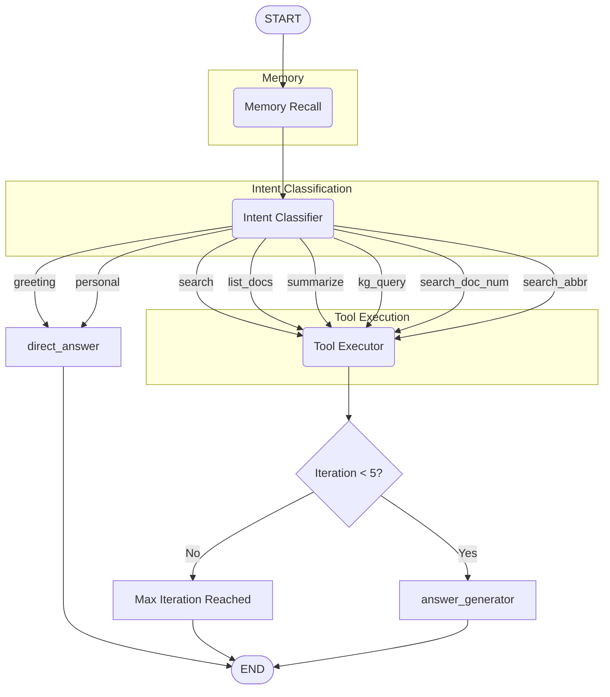

# LangGraph Agent Diagram

This document shows the LangGraph workflow for the NexusRAG agent.

## Overview

The agent uses a state-driven graph architecture with memory recall, intent classification, tool execution, and answer generation.

## Flow Diagram

## Node Descriptions

| Node | Description |
|------|-------------|
| **memory_recall** | Loads user memories from Graphiti (temporal knowledge graph) |
| **intent_classifier** | Classifies intent using Qwen3-4B and rewrites query |
| **tool_executor** | Dispatches to appropriate tool based on intent |
| **answer_generator** | Main LLM generates answer with retrieved context |
| **direct_answer** | Answers greetings/chitchat directly without retrieval |

## Intent Routing

| Intent | Route |
|--------|-------|
| `greeting` | → direct_answer |
| `personal` | → direct_answer |
| `search` | → tool_executor |
| `list_docs` | → tool_executor |
| `summarize` | → tool_executor |
| `kg_query` | → tool_executor |
| `search_doc_num` | → tool_executor |
| `search_abbr` | → tool_executor |

## Available Tools

| Tool | Purpose |
|------|---------|
| `search_documents` | Semantic search across document chunks |
| `list_documents` | List documents in workspace |
| `summarize_document` | Generate document summary |
| `query_knowledge_graph` | Query extracted entities/relationships |
| `search_documents_number` | Search by document number/reference |
| `search_abbreviation` | Search abbreviation definitions |

## Iteration Loop

After `tool_executor`, there's a check to ensure the graph doesn't exceed 5 iterations:

1. `tool_executor` executes the tool
2. Check if iteration count < 5
3. If yes → proceed to `answer_generator`
4. If no → terminate with max iteration reached message
