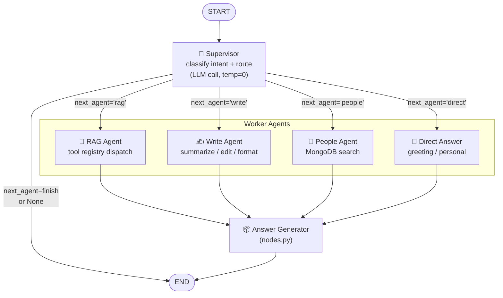

# LangGraph Agent Diagram

This document shows the LangGraph supervisor-based multi-agent workflow for NexusRAG.

## Overview

The agent uses a **Supervisor-Worker** architecture: a single LLM call classifies intent and
routes to the appropriate worker agent. Each worker handles its domain, then all routes converge
at `answer_generator` for final answer generation and SSE streaming.

## Flow Diagram


```mermaid
flowchart TD
    START([START]) --> supervisor["🧠 Supervisor\nclassify intent + route\n(LLM call, temp=0)"]

    supervisor -->|"next_agent='rag'"| rag["📄 RAG Agent\ntool registry dispatch"]
    supervisor -->|"next_agent='write'"| write["✍️ Write Agent\nsummarize / edit / format"]
    supervisor -->|"next_agent='people'"| people["👤 People Agent\nMongoDB search"]
    supervisor -->|"next_agent='direct'"| direct["💬 Direct Answer\ngreeting / personal"]
    supervisor -->|"next_agent=finish\nor None"| END([END])

    rag --> ag["📦 Answer Generator\n(nodes.py)"]
    write --> ag
    people --> ag
    direct --> ag

    ag --> END

    subgraph "Worker Agents"
        rag
        write
        people
        direct
    end
```

## Node Descriptions

| Node | File | Description |
|------|------|-------------|
| **supervisor** | `agents/supervisor.py` | LLM-based router: classify intent + pick next agent in one call |
| **rag** | `agents/rag_agent.py` | Tool registry for document search, KG, abbreviations, doc numbers |
| **write** | `agents/write_agent.py` | Text processing: summarize, suggest edits, grammar/format check |
| **people** | `agents/people_agent.py` | MongoDB people search: CCCD, name, BHXH, phone |
| **direct** | `agents/supervisor.py` | Direct LLM answer for greetings and personal questions |
| **answer_generator** | `agent/nodes.py` | Main LLM generates final answer with retrieved context + sources |

## Intent Routing

| Intent | Agent | Description |
|--------|-------|-------------|
| `greeting` | direct | Greetings, thanks, farewells |
| `personal` | direct | Questions about the user themselves |
| `search` | rag | Document content search (hybrid RAG) |
| `list_docs` | rag | List available documents in workspace |
| `summarize` | rag | Fetch and summarize a specific document |
| `kg_query` | rag | Knowledge graph entity/relationship lookup |
| `search_doc_num` | rag | Search by official document number |
| `search_abbr` | rag | Abbreviation/acronym lookup |
| `mongo_search_cccd` | people | Search person by CCCD number |
| `mongo_search_name` | people | Search person by name |
| `mongo_search_bhxh` | people | Search person by BHXH number |
| `mongo_search_phone` | people | Search person by phone number |
| `write_summarize` | write | Summarize a provided text passage |
| `write_suggest_edits` | write | Suggest editing improvements |
| `write_grammar_check` | write | Grammar and style check |
| `write_format_check` | write | Word document format check (30/2020/NĐ-CP) |

## SSE Event Flow

```
stream_agent_to_sse()
  ├── supervisor_node  → (no event)
  ├── worker node      → status, sources, images events
  └── answer_generator → status, token × N, complete events
```

## Streaming Architecture

Nodes communicate with the SSE layer via `ContextVar` (not LangGraph state keys, which are
filtered by TypedDict). See `agent/streaming.py` for details.

```
stream_agent_to_sse
  ├── set _event_queue_ctx  (ContextVar — bypasses LangGraph state filtering)
  ├── asyncio.create_task(graph.ainvoke)  ← inherits context
  │     nodes call push_event() → ContextVar.get() → queue.put()
  └── drain queue → yield SSE strings
```
