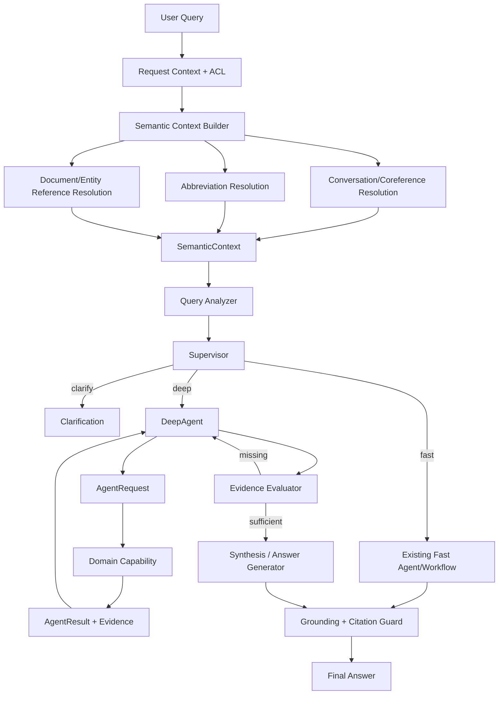

# AIRAG Agent Contract v1 — Nghiên cứu cải thiện LangGraph và tích hợp DeepAgent

**Trạng thái:** DRAFT / research design — dùng để review kiến trúc trước khi triển khai.

**Mục tiêu:** Chuẩn hóa luồng dữ liệu và contract giao tiếp giữa Semantic Context Builder, Query Analyzer, Supervisor, DeepAgent và các capability/domain worker; giữ fast path cho câu hỏi đơn giản nhưng hỗ trợ tốt multi-step, multi-document, cross-agent, conversation follow-up, abbreviation resolution và evidence-driven reasoning.

**Liên quan:** `docs/deepagent-hybrid-proposal.md`, `backend/app/services/agents/models.py`, `backend/app/services/agent/state.py`.

---

## 1. Quyết định kiến trúc chính

LangGraph vẫn là orchestration/runtime layer. AIRAG cần thêm một domain contract riêng.

```text
LangGraph
= state + routing + lifecycle + Command/Send/subgraph

AIRAG Agent Contract
= semantics + scope + permission + task/result + evidence
```

Không dùng `SupervisorState` như universal business interface cho mọi agent/capability.

Kiến trúc mục tiêu:

```text
User Request
    ↓
Request Context / ACL
    ↓
Semantic Context Builder
    ↓
Query Analysis
    ↓
Supervisor
    ├── fast ──→ Existing Fast Path
    │
    ├── clarify ──→ Clarification
    │
    └── deep ──→ DeepAgent
                    ↓
                 Task Plan
                    ↓
                 AgentRequest
                    ↓
                 Capability
                    ↓
                 AgentResult + Evidence
                    ↓
              Evidence Evaluator
                 │          │
              missing    sufficient
                 │          │
                 └── DeepAgent
                            ↓
                        Synthesis
                            ↓
                    Grounding/Citation
                            ↓
                        Final Answer
```

---

## 2. Vấn đề cần giải quyết

AIRAG hiện chia sẻ nhiều field qua `SupervisorState`: query, workspace/document scope, sources, Mongo results, KG summaries, task plan, retry state, judge state, permission và output.

Khi thêm DeepAgent, cách này tạo một số vấn đề:

- DeepAgent phải biết quá nhiều implementation detail của graph hiện tại.
- People/RAG/Resolve Doc dễ bị biến thành pseudo-agent phụ thuộc toàn bộ Supervisor state.
- `sources`, `kg_summaries`, `mongo_results`, `final_answer` vừa là runtime state vừa là output ngầm giữa component.
- `bool(sources)` không nói được câu hỏi phức tạp đã đủ evidence hay chưa.
- Follow-up như “nghị định này”, “người đó”, “điều trên”, “file thứ hai” không thể xử lý chắc chắn nếu chỉ nhìn query hiện tại.
- Viết tắt có thể làm query analyzer/supervisor phân loại sai nếu được resolve quá muộn.
- Một `document_ids` duy nhất không đủ biểu diễn target document và reference document.

---

## 3. Nguyên tắc contract

1. Contract độc lập với caller: Supervisor, DeepAgent, subgraph hay worker đều dùng cùng interface.
2. `workspace_ids` và document scope là explicit, không suy ra từ prompt.
3. Child task chỉ được thu hẹp authorization scope của parent.
4. Target document và reference document là hai vai trò khác nhau.
5. Conversation context không đồng nghĩa permission.
6. Permission không do LLM quyết định.
7. Original query luôn được giữ nguyên; mọi normalized/contextualized query chỉ là derived data.
8. Abbreviation/coreference resolution phải có status/provenance, không chỉ overwrite text.
9. Evidence là first-class object và phải giữ provenance theo task/document.
10. `AgentResult` mô tả kết quả nghiệp vụ; LangGraph `Command` quyết định routing.
11. `partial`, `not_found`, `needs_input`, `denied`, `error` phải có semantics khác nhau.
12. Contract phải versioned.

---

# PHẦN A — INPUT CONTEXT

## 4. Ba lớp context cần tách riêng

AIRAG nên tách ba khái niệm:

```text
ConversationContext
= hội thoại trước đang nói về object nào?

SemanticContext
= câu hiện tại sau khi resolve context/viết tắt/tham chiếu được hiểu thế nào?

ExecutionScope
= request/task được phép truy cập dữ liệu nào?
```

Thêm lớp thứ tư:

```text
ExecutionContext
= ai đang gọi, session nào, có permission gì?
```

Không trộn bốn lớp này thành một state lớn.

---

## 5. `ConversationContext`

Conversation context dùng cho short-term discourse state, đặc biệt với follow-up.

Không nên gửi toàn bộ lịch sử 30–50 turn vào mọi capability. Thay vào đó lưu một context đã chuẩn hóa.

```python
class ConversationContext(BaseModel):
    thread_id: str | None = None

    active_documents: list["ActiveEntity"] = Field(default_factory=list)
    active_people: list["ActiveEntity"] = Field(default_factory=list)
    active_sections: list["ActiveEntity"] = Field(default_factory=list)
    active_files: list["ActiveEntity"] = Field(default_factory=list)

    last_focus: "EntityReference | None" = None

    previous_query: str | None = None
    previous_intent: str | None = None
```

Ví dụ:

```text
Turn 1: "Nghị định A quy định gì về dữ liệu cá nhân?"
Turn 2: "Nghị định này có quy định mức phạt không?"
```

Sau turn 1:

```json
{
  "active_documents": [
    {
      "entity_id": "doc-A",
      "label": "Nghị định A",
      "introduced_turn_id": "turn-1"
    }
  ],
  "last_focus": {
    "entity_type": "document",
    "entity_id": "doc-A"
  }
}
```

Turn 2 có thể resolve `"Nghị định này" -> doc-A` trước khi vào Query Analyzer.

### Conversation Context khác Memory

```text
"nghị định này"
"người vừa nói"
"file thứ hai"
"điều trên"
→ Conversation Context

"đơn vị tôi"
"sở thích của tôi"
"thông tin dài hạn về người dùng"
→ Memory
```

Không dùng long-term memory để giải quyết coreference đang có antecedent ngay trong conversation.

---

## 6. `SemanticContext`

`SemanticContext` là output của semantic preprocessing/context resolution.

```python
class SemanticContext(BaseModel):
    original_query: str
    contextualized_query: str
    normalized_query: str

    abbreviations: list["AbbreviationResolution"] = Field(default_factory=list)
    coreferences: list["CoreferenceResolution"] = Field(default_factory=list)

    document_refs: list["DocumentReference"] = Field(default_factory=list)
    person_refs: list["EntityReference"] = Field(default_factory=list)
    section_refs: list["SectionReference"] = Field(default_factory=list)

    blocking_ambiguities: list[str] = Field(default_factory=list)
```

Giữ đủ ba dạng query:

```text
original_query
= text đúng như user nhập

contextualized_query
= đã resolve "nghị định này", "người đó", "file thứ hai"...

normalized_query
= contextualized query + abbreviation/entity normalization
```

Ví dụ:

```text
original_query:
"NĐ này quy định gì về DLCN?"

contextualized_query:
"NĐ 13/2023/NĐ-CP quy định gì về DLCN?"

normalized_query:
"Nghị định 13/2023/NĐ-CP quy định gì về dữ liệu cá nhân?"
```

Downstream có thể đọc normalized query để reasoning nhưng vẫn audit được raw input.

---

## 7. Contract cho từ viết tắt

Không đặt abbreviation trong `ExecutionScope`. Abbreviation là semantic metadata.

```python
class AbbreviationResolution(BaseModel):
    span: str
    short_form: str

    chosen: str | None = None
    candidates: list[str] = Field(default_factory=list)

    status: Literal[
        "resolved",
        "ambiguous",
        "unknown",
    ]

    source: str | None = None
    confidence: float | None = None
```

Ví dụ:

```json
{
  "span": "DLCN",
  "short_form": "DLCN",
  "chosen": "dữ liệu cá nhân",
  "candidates": ["dữ liệu cá nhân"],
  "status": "resolved"
}
```

Nếu nhiều nghĩa:

```json
{
  "span": "BMNN",
  "short_form": "BMNN",
  "chosen": null,
  "candidates": ["...", "..."],
  "status": "ambiguous"
}
```

### Workflow abbreviation

Mọi query đi qua semantic preprocessing, nhưng không phải mọi query gọi full abbreviation resolution.

```text
Query
 ↓
protect identifiers
 ↓
detect abbreviation candidates       ← cheap / always
 ↓
no candidate? ───────────────→ continue
 ↓ yes
batch abbreviation lookup
 ↓
unique meaning ──────────────→ annotate + normalize
multiple meanings ───────────→ conditional disambiguation
unknown ─────────────────────→ keep original
```

Không gọi một LLM abbreviation agent cho mọi câu hỏi.

### Identifier protection

Không expand mù quáng các span như:

```text
12/2024/NĐ-CP
012345678901
QĐ123
A01
quoted literals
```

Document numbers, CCCD, phone, IDs và quoted text phải được protect trước abbreviation normalization.

### DeepAgent và abbreviation

Global Semantic Context Builder xử lý abbreviation trong user query. Nếu DeepAgent gặp abbreviation mới trong quá trình research, nó có thể dùng capability:

```text
abbreviation.resolve
```

Cả hai cùng dùng chung abbreviation service, không duplicate logic.

---

## 8. Contract cho coreference/follow-up

```python
class CoreferenceResolution(BaseModel):
    span: str

    entity_type: Literal[
        "document",
        "person",
        "section",
        "workspace",
        "file",
    ]

    resolved_id: str | None = None
    resolved_label: str | None = None

    source_turn_id: str | None = None

    status: Literal[
        "resolved",
        "ambiguous",
        "unresolved",
    ]

    confidence: float | None = None
```

Ví dụ:

```text
Turn 1: "Nghị định A quy định gì?"
Turn 2: "Nghị định này có mức phạt không?"
```

Semantic context của turn 2:

```json
{
  "original_query": "Nghị định này có mức phạt không?",
  "contextualized_query": "Nghị định A có mức phạt không?",
  "coreferences": [
    {
      "span": "Nghị định này",
      "entity_type": "document",
      "resolved_id": "doc-A",
      "resolved_label": "Nghị định A",
      "source_turn_id": "turn-1",
      "status": "resolved"
    }
  ]
}
```

### Ambiguous follow-up

```text
Turn 1: "So sánh Nghị định A với Nghị định B"
Turn 2: "Nghị định này có hiệu lực từ khi nào?"
```

Nếu không đủ căn cứ xác định A hay B:

```json
{
  "coreferences": [
    {
      "span": "Nghị định này",
      "entity_type": "document",
      "resolved_id": null,
      "status": "ambiguous"
    }
  ],
  "blocking_ambiguities": [
    "Không xác định được 'nghị định này' là A hay B"
  ]
}
```

Router nên chọn `clarify`, không để DeepAgent tự đoán.

### Security invariant

Coreference chỉ resolve identity, không cấp quyền:

```text
ConversationContext
   ↓
resolve "nghị định này" → doc-A
   ↓
ACL / current permissions
   ↓
ExecutionScope
```

Một document từng xuất hiện ở turn trước không có nghĩa user mặc nhiên được truy cập ở turn hiện tại.

---

# PHẦN B — QUERY SCOPE

## 9. `ExecutionScope`

`workspace_ids` + document IDs tạo retrieval scope của query/task.

```python
class ExecutionScope(BaseModel):
    workspace_ids: list[str] = Field(default_factory=list)

    # Compatibility / fast-path narrowing.
    document_ids: list[str] | None = None

    # SUBJECT của query/task.
    target_document_ids: list[str] = Field(default_factory=list)

    # Nguồn chuẩn/căn cứ đã resolve.
    reference_document_ids: list[str] = Field(default_factory=list)

    reference_search_scope: Literal[
        "none",
        "workspace",
        "corpus",
    ] = "none"

    allow_reference_discovery: bool = False
```

### Scope semantics

```text
workspace_ids=[W1,W2]
document_ids=null
```

→ tìm toàn W1/W2 trong ACL.

```text
workspace_ids=[W1]
document_ids=[D1,D2]
```

→ chỉ D1/D2.

Conceptually:

```text
effective_scope
= current_user_permissions
  ∩ workspace_ids
  ∩ document narrowing
```

`workspace_ids` là boundary lớn hơn; document IDs là narrowing.

---

## 10. Target vs Reference

Ví dụ user upload hai file rồi hỏi:

> Kiểm tra hai file này có đúng với quy định A không.

Scope:

```json
{
  "workspace_ids": ["W1"],
  "target_document_ids": ["F1", "F2"],
  "reference_document_ids": ["A"],
  "reference_search_scope": "none",
  "allow_reference_discovery": false
}
```

Ý nghĩa:

```text
F1,F2 = thứ cần đánh giá
A     = chuẩn dùng để đánh giá
```

Không gom cả ba thành một `document_ids` rồi bắt synthesizer tự suy ra vai trò.

### Reference discovery

User:

> Kiểm tra hai file này có đúng các quy định hiện hành về thể thức văn bản hành chính không.

```json
{
  "workspace_ids": ["W1"],
  "target_document_ids": ["F1", "F2"],
  "reference_document_ids": [],
  "reference_search_scope": "workspace",
  "allow_reference_discovery": true
}
```

DeepAgent được resolve/search thêm reference trong boundary cho phép, nhưng không được tự thêm `F3` vào target.

### Parent/child scope

```text
Parent targets = [A,B,C]

child [A]      OK
child [A,B]    OK
child [D]      DENY
child all docs DENY
```

Target scope mặc định immutable. Reference scope chỉ dynamic khi explicit policy cho phép.

---

## 11. `ExecutionContext`

```python
class ExecutionContext(BaseModel):
    user_id: str | None = None
    session_id: str | None = None
    trace_id: str | None = None

    permissions: list[str] = Field(default_factory=list)

    language: str = "vi"
```

Permission phải do backend cung cấp.

Ví dụ:

```json
{
  "user_id": "U1",
  "permissions": ["documents.read", "people.read"],
  "language": "vi"
}
```

DeepAgent không được tự thêm `people.read` vì prompt yêu cầu CCCD.

---

# PHẦN C — QUERY ANALYSIS VÀ ROUTING

## 12. `QueryAnalysis`

Query Analyzer nên nhận `SemanticContext + ExecutionScope`, không chỉ raw query.

```python
class QueryAnalysis(BaseModel):
    complexity: Literal[
        "simple",
        "multi_doc",
        "multi_section",
        "cross_agent",
        "comparison",
    ]

    execution_mode: Literal[
        "fast",
        "deep",
        "clarify",
    ]

    required_capabilities: list[str] = Field(default_factory=list)
    dependencies: list[dict] = Field(default_factory=list)

    scope: ExecutionScope
```

### Fast path

Dùng khi AIRAG đã có workflow bounded/deterministic:

```text
"CCCD của A là gì?"                → People
"Tóm tắt Điều 5 của A"             → Resolve/RAG
"Nghị định A quy định gì về X?"    → RAG
```

### Deep path

Dùng khi:

- cần nhiều target rồi compare/synthesize;
- cross-capability;
- bước sau phụ thuộc kết quả runtime của bước trước;
- phải evaluate evidence rồi quyết định search tiếp;
- summary cần map-reduce/hierarchy;
- workflow fast hiện tại không biểu diễn dependency đầy đủ.

Ví dụ:

```text
"CCCD của A xuất hiện trong nghị định nào?" → deep
"So sánh A và B về nghĩa vụ X"              → deep
"Kiểm tra F1/F2 có đúng quy định A"         → deep
```

### Clarify

Dùng khi blocking ambiguity ảnh hưởng trực tiếp target/scope/objective.

---

# PHẦN D — AGENT/CAPABILITY CONTRACT

## 13. Phân biệt Agent và Capability

### Agent

Có reasoning/planning/orchestration.

```text
Supervisor
DeepAgent
Synthesis/Analysis agent (nếu tách sau này)
```

### Capability

Thực hiện domain operation với interface rõ ràng.

```text
people.lookup
abbreviation.resolve
document.resolve
document.search
document.read_section
document.summarize
document.list
kg.query
memory.search
```

Không expose trực tiếp Mongo collection, vector DB client, Neo4j session hoặc internal LangGraph node cho DeepAgent.

---

## 14. `AgentRequest`

```python
class AgentRequest(BaseModel):
    contract_version: str = "1.0"

    request_id: str
    task_id: str
    parent_task_id: str | None = None

    capability: str
    objective: str

    inputs: dict[str, Any] = Field(default_factory=dict)

    semantic_context: SemanticContext | None = None
    conversation_context: ConversationContext | None = None

    scope: ExecutionScope
    context: ExecutionContext

    expected_output: str | None = None
```

Rules:

- `inputs` = task cần làm gì.
- `scope` = được phép làm ở đâu.
- `semantic_context` = query đã được hiểu thế nào.
- `conversation_context` chỉ truyền khi capability thực sự cần; không mặc định gửi toàn bộ context cho mọi tool.

---

## 15. `AgentResult`

```python
class AgentResult(BaseModel):
    contract_version: str = "1.0"

    request_id: str
    task_id: str

    status: Literal[
        "success",
        "partial",
        "not_found",
        "needs_input",
        "denied",
        "error",
    ]

    data: dict[str, Any] | None = None

    evidence: list["Evidence"] = Field(default_factory=list)
    missing: list[str] = Field(default_factory=list)

    confidence: float | None = None
    scope_used: ExecutionScope | None = None

    error: "AgentError" | None = None
```

### Status semantics

`success` — đủ objective trong scope.

`partial` — có kết quả hữu ích nhưng thiếu thành phần để kết luận; `missing` phải mô tả thiếu gì.

`not_found` — search/lookup đã hoàn thành bình thường trong scope nhưng không có kết quả.

`needs_input` — cần user/caller cung cấp thêm dữ liệu.

`denied` — không đủ permission hoặc scope violation.

`error` — infrastructure/runtime failure.

Timeout/backend outage không được đổi thành `not_found`.

---

## 16. Evidence

```python
class Evidence(BaseModel):
    evidence_id: str

    source_type: Literal[
        "document",
        "knowledge_graph",
        "people",
        "memory",
    ]

    role: Literal[
        "target",
        "reference",
        "supporting",
    ] = "supporting"

    task_id: str | None = None

    document_id: str | None = None
    document_title: str | None = None

    section: str | None = None
    chunk_id: str | None = None

    content: str

    metadata: dict[str, Any] = Field(default_factory=dict)
    relevance: float | None = None
```

Invariants:

- `source_type=document` ⇒ phải có `document_id`.
- Evidence phải giữ `task_id` nếu được sinh từ DeepAgent subtask.
- Target/reference role không được mất qua fan-out/fan-in.
- Synthesizer không đoán document identity từ text.
- Citation layer map `evidence_id` về citation/source UI sau cùng.

---

## 17. Error contract

```python
class AgentError(BaseModel):
    code: Literal[
        "INVALID_INPUT",
        "SCOPE_VIOLATION",
        "PERMISSION_DENIED",
        "AMBIGUOUS_ENTITY",
        "DEPENDENCY_UNAVAILABLE",
        "TIMEOUT",
        "INTERNAL_ERROR",
    ]

    message: str
    retryable: bool = False
    details: dict[str, Any] = Field(default_factory=dict)
```

DeepAgent có thể tham khảo `retryable`, nhưng retry/deadline policy vẫn phải do runtime enforce.

---

## 18. Capability Descriptor

```python
class CapabilityDescriptor(BaseModel):
    name: str
    version: str
    description: str

    required_permissions: list[str] = Field(default_factory=list)

    cost_class: Literal[
        "cheap",
        "normal",
        "expensive",
    ] = "normal"

    supports_parallel: bool = False

    input_schema: dict[str, Any]
    output_schema: dict[str, Any]
```

DeepAgent nên thấy capability abstraction, không thấy implementation detail.

---

# PHẦN E — USE CASE FLOWS

## 19. People → Document cross-agent

User:

> Số căn cước công dân của Nguyễn Văn A có liên quan gì đến các nghị định?

Query Analysis:

```json
{
  "complexity": "cross_agent",
  "execution_mode": "deep",
  "required_capabilities": [
    "people.lookup",
    "document.search"
  ],
  "dependencies": [
    {
      "from": "people.lookup",
      "to": "document.search",
      "reason": "CCCD lấy từ People là input cho document search"
    }
  ]
}
```

DeepAgent:

```text
T1 people.lookup(name=A)
    ↓
CCCD=X
    ↓
T2 document.search(query=X)
    ↓
T3 document.search(query=A) nếu cần
    ↓
T4 evidence verification
    ↓
synthesis
```

DeepAgent không gọi trực tiếp `people_agent_node()`. Supervisor fast People path và DeepAgent tool cùng dùng chung People service/capability.

---

## 20. Multi-document comparison

User:

> So sánh Chương III của A với Chương II của B.

Parent scope:

```json
{
  "workspace_ids": ["W1"],
  "target_document_ids": ["A", "B"]
}
```

Execution:

```text
Research-A scope=[A] ──┐
                       ├──→ Evidence Evaluator → Compare/Synthesis
Research-B scope=[B] ──┘
```

N document dùng cùng model:

```text
A → task A
B → task B
C → task C
...
fan-in → synthesis
```

---

## 21. Target/reference compliance

User:

> Kiểm tra nội dung F1 và F2 có đúng với quy định A không.

```text
Reference A ───────→ extract requirements ──────┐
                                                 │
Target F1 ─────────→ extract relevant content ──┼─→ compliance matrix
Target F2 ─────────→ extract relevant content ──┘
```

Evidence:

```text
EV-A-1  role=reference document=A
EV-F1-1 role=target    document=F1
EV-F2-1 role=target    document=F2
```

Output trung gian nên có requirement mapping, không chỉ prose answer.

---

## 22. Follow-up document reference

```text
Turn 1:
"Nghị định A quy định gì về dữ liệu cá nhân?"

Turn 2:
"Nghị định này có quy định mức phạt không?"
```

Data flow:

```text
ConversationContext.active_documents=[A]
        ↓
CoreferenceResolver
        ↓
"Nghị định này" → A
        ↓
SemanticContext.contextualized_query
        ↓
ExecutionScope.document_ids=[A]
        ↓
QueryAnalyzer → fast RAG
```

Không cần DeepAgent chỉ vì query có coreference nếu sau resolution task trở thành simple/bounded.

---

## 23. Follow-up tạo complex query

```text
Turn 1:
"Nghị định A quy định gì về X?"

Turn 2:
"So sánh nghị định này với B và cho biết nội dung nào chặt hơn."
```

Data flow:

```text
"nghị định này" → A
        ↓
SemanticContext.document_refs=[A,B]
        ↓
ExecutionScope.target_document_ids=[A,B]
        ↓
QueryAnalyzer
  complexity=comparison
  execution_mode=deep
        ↓
DeepAgent
```

Conversation resolution xảy ra trước complexity routing.

---

# PHẦN F — LANGGRAPH DATA FLOW

## 24. Target Data Flow sau nâng cấp

Đây là flow chuẩn đề xuất cho một request.



### Data objects qua từng boundary

```text
Raw Request
    ↓
ConversationContext + ExecutionContext
    ↓
SemanticContext
    ↓
QueryAnalysis + ExecutionScope
    ↓
AgentRequest[]
    ↓
AgentResult[] + Evidence[]
    ↓
TaskEvaluationResult
    ↓
Final Answer + Citations
```

---

## 25. Semantic Context Builder

Đề xuất thêm stage trước Query Analyzer:

```text
START
 ↓
request_context / ACL
 ↓
semantic_context_builder
   ├── coreference/follow-up resolution
   ├── abbreviation candidate detection
   ├── conditional abbreviation lookup/disambiguation
   ├── document/person/section reference extraction
   └── contextualized + normalized query
 ↓
query_analyzer
 ↓
supervisor
```

Không bắt mọi request gọi LLM ở preprocessor. Các check rẻ/no-op phải đi trước; chỉ resolve sâu khi cần.

Ví dụ greeting:

```text
"Xin chào"
→ no coreference
→ no abbreviation
→ no document refs
→ direct fast path
```

---

## 26. State ↔ Contract adapter

```text
LangGraph State
      ↓ build_request()
AgentRequest
      ↓
Capability
      ↓
AgentResult
      ↓ apply_result()
LangGraph State
```

Capability không đọc/ghi tùy ý toàn bộ `SupervisorState`.

### Mapping hiện tại → contract

```text
SupervisorState.workspace_ids
    → ExecutionScope.workspace_ids

SupervisorState.document_ids
    → ExecutionScope.document_ids
      hoặc target_document_ids theo semantic role

SupervisorState.user_id
    → ExecutionContext.user_id

SupervisorState.user_can_use_people
    → permissions includes people.read

SupervisorState.rewritten_query/original_query
    → SemanticContext

SupervisorState.abbreviation_results
    → SemanticContext.abbreviations

SupervisorState.sources
    → Evidence[]

SupervisorState.mongo_results
    → AgentResult.data

SupervisorState.kg_summaries
    → AgentResult.data / Evidence(KG)

SupervisorState.sub_queries
    → QueryAnalysis dependencies / DeepAgent plan

SupervisorState.accumulated_results
    → AgentResult[] theo task
```

Phase đầu có thể giữ compatibility bằng adapter, chưa cần big-bang rewrite state.

---

## 27. LangGraph `Command` và `Send`

`AgentResult` không chứa `goto`.

```python
result = await capability.execute(request)

if result.status == "success":
    return Command(
        update={"task_results": [result]},
        goto="deep_agent",
    )
```

```text
AgentResult
= what happened

Command
= what graph should do next
```

Multi-document independent branches có thể dùng `Send`/subgraph hoặc bounded DeepAgent parallel task; mỗi branch phải nhận immutable child scope riêng.

---

# PHẦN G — EVIDENCE EVALUATION

## 28. Evidence Evaluator

Không chỉ kiểm tra `has_results = bool(sources)`.

```python
class TaskEvaluationInput(BaseModel):
    objective: str
    requirements: list[str]
    results: list[AgentResult]


class TaskEvaluationResult(BaseModel):
    status: Literal[
        "sufficient",
        "insufficient",
        "contradictory",
        "needs_input",
    ]

    coverage: float
    missing: list[str]
    contradictions: list[str]
    suggested_capabilities: list[str]
```

Ví dụ:

```json
{
  "status": "insufficient",
  "coverage": 0.62,
  "missing": [
    "Chưa có quy định về ngoại lệ của văn bản B"
  ],
  "suggested_capabilities": [
    "document.read_section",
    "document.search"
  ]
}
```

DeepAgent dùng `missing` cho targeted research thay vì retry mù.

---

# PHẦN H — PERMISSION, SECURITY, OBSERVABILITY

## 29. Tool exposure theo permission

Ví dụ People:

```text
if people.read:
    expose people.lookup
else:
    omit people.lookup
```

Nhưng People service vẫn kiểm tra quyền lần nữa.

Defense in depth:

```text
Tool exposure gate
      +
Capability/service permission gate
      +
Workspace/document scope enforcement
```

Không dựa vào prompt để bảo vệ CCCD/BHXH/person data.

---

## 30. Streaming

Worker/capability không tự stream final answer.

```python
class AgentProgressEvent(BaseModel):
    request_id: str
    task_id: str

    event: Literal[
        "started",
        "searching",
        "resolved",
        "evaluating",
        "completed",
        "failed",
    ]

    detail: str | None = None
```

Subtasks chỉ emit progress/tool status. Outer synthesis/answer layer chịu trách nhiệm final answer stream.

---

## 31. Observability

Trace nên ghi:

```text
request_id
semantic_context
resolved coreferences
resolved abbreviations
query analysis
execution_mode
scope requested / scope used
task_id / parent_task_id
capability called
status
evidence_ids
missing requirements
latency
retry/dependency failures
final synthesis
```

Metrics cần benchmark:

```text
fast/deep routing accuracy
coreference resolution accuracy
abbreviation resolution accuracy
document resolution accuracy
scope violation count
capability selection accuracy
evidence coverage
partial-result rate
cross-agent success rate
comparison completeness
citation correctness / faithfulness
p50/p95 fast path latency
p50/p95 deep path latency
```

---

## 32. Các invariant bắt buộc

1. `original_query` không bị overwrite.
2. Coreference resolution không cấp permission.
3. Abbreviation resolution phải giữ candidate/status/provenance khi có ambiguity.
4. DeepAgent không được mở rộng `workspace_ids`.
5. Child task không được tự thêm target document ngoài parent scope.
6. Reference discovery chỉ khi policy cho phép.
7. Không có permission → capability không expose; service vẫn deny direct call.
8. `not_found` chỉ dùng khi lookup hoàn thành bình thường trong scope.
9. Timeout/backend outage không được chuyển thành `not_found`.
10. Mọi document evidence phải có `document_id`.
11. Evidence phải giữ task/document provenance qua fan-out/fan-in.
12. Capability không điều khiển graph topology.
13. Blocking ambiguity thiết yếu → clarify, không để DeepAgent tự đoán.
14. Final synthesis phải biết phần evidence nào còn thiếu nếu evaluator chưa đủ coverage.

---

# PHẦN I — MIGRATION RESEARCH PLAN

## 33. Phase A — Context + Contract models

- Định nghĩa Pydantic models cho ConversationContext, SemanticContext, ExecutionScope, ExecutionContext, AgentRequest, AgentResult, Evidence, AgentError.
- Tạo Semantic Context Builder trước Query Analyzer.
- Tái sử dụng abbreviation service hiện tại qua adapter.
- Thêm coreference/follow-up resolver cho document/person/section focus.
- Chưa thay routing hiện tại.
- Log contract vào tracing để đánh giá.

## 34. Phase B — Contract adapters cho fast path

- Adapter People và RAG hiện tại sang AgentRequest/AgentResult.
- Không thay business behavior hiện tại.
- Kiểm tra regression về latency và permission.
- Mapping `SupervisorState` ↔ contract chỉ tại boundary.

## 35. Phase C — DeepAgent pilot

- Query Analyzer thêm `fast/deep/clarify`.
- DeepAgent chỉ nhận curated capabilities.
- Pilot hai nhóm:
  - multi-document comparison;
  - cross-agent People → document research.
- Feature flag giữ fallback static/ReAct path hiện tại.

## 36. Phase D — Evidence-driven execution

- Semantic evidence evaluator.
- `partial + missing` targeted retry.
- task-scoped AgentResult.
- bounded fan-out cho multi-document.

## 37. Phase E — Simplify graph

- Giảm duplicated planning trong Supervisor.
- Giảm reliance vào universal SupervisorState.
- Benchmark DeepAgent so với custom ReAct executor.
- Chỉ retire ReAct path nếu DeepAgent tốt hơn về correctness/latency/cost và grounding.

---

# PHẦN J — REVIEW CASES

## 38. Fast path

```text
CCCD của Nguyễn Văn A là gì?
Tóm tắt Điều 5 văn bản A.
Nghị định A quy định gì về X?
```

Kỳ vọng: semantic preprocessing gần như no-op hoặc cheap; không vào DeepAgent nếu không cần.

## 39. Abbreviation

```text
NĐ 13 quy định gì về DLCN?
So sánh NĐ 13 với Luật ANM về DLCN.
```

Kỳ vọng: abbreviation được annotate/normalize trước routing, không làm hỏng số hiệu văn bản.

## 40. Conversation/coreference

```text
Turn 1: Nghị định A quy định gì về X?
Turn 2: Nghị định này có mức phạt không?
```

Kỳ vọng: `nghị định này → A`; fast RAG.

```text
Turn 1: So sánh A và B.
Turn 2: Nghị định này có hiệu lực khi nào?
```

Kỳ vọng: nếu ambiguous → clarify.

## 41. Multi-document

```text
So sánh Chương II của A với Chương III của B.
So sánh A, B và C theo trách nhiệm của cơ quan quản lý.
```

Kỳ vọng: deep path; task scope theo từng document; provenance không bị trộn.

## 42. Cross-agent

```text
CCCD của Nguyễn Văn A xuất hiện trong nghị định nào?
Người có BHXH X có liên quan đến những văn bản nào trong workspace?
```

Kỳ vọng: People result làm dependency input cho document research.

## 43. Target/reference

```text
Kiểm tra hai file upload có đúng quy định A không.
Đối chiếu F1 với A và B, chỉ ra điểm không phù hợp.
```

Kỳ vọng: target/reference role rõ ràng.

## 44. Reference discovery

```text
Kiểm tra hai file này có đúng các quy định hiện hành về thể thức văn bản hành chính không.
```

Kỳ vọng: target immutable; reference discovery chỉ trong policy scope.

## 45. Scope/permission safety

```text
Parent chỉ cho [A,B], DeepAgent thử search D.
User không có people.read nhưng query yêu cầu CCCD.
Coreference resolve A từ turn trước nhưng quyền đọc A đã bị revoke.
```

Kỳ vọng: deny ở runtime/service layer, không dựa vào model judgment.

---

## 46. Câu hỏi cần review trước implementation

1. `ConversationContext` nên được persist ở đâu: graph/thread state, cache hay reconstruct từ recent turns?
2. Coreference resolver dùng deterministic-first + LLM fallback hay một structured LLM pass?
3. Semantic Context Builder có thể hợp nhất với classifier để tránh thêm latency LLM không?
4. `document_ids` nên giữ lâu dài cho compatibility hay sau migration chỉ còn target/reference IDs?
5. `reference_search_scope="corpus"` chính xác tương ứng data source nào trong AIRAG?
6. Khi abbreviation ambiguous nhưng không ảnh hưởng intent/scope, có cần block query không?
7. Evidence evaluator dùng rule + LLM judge hay structured LLM judge duy nhất?
8. DeepAgent planner có cần explicit dependency DAG hay todo-style planning đủ cho pilot?
9. Conversation coreference có cần giữ ordinal (`thứ nhất`, `thứ hai`) như first-class metadata không?
10. DeepAgent có synthesize answer hay chỉ trả ResearchResult cho existing answer generator?
11. Multi-document fan-out giới hạn bao nhiêu branch để giữ latency mục tiêu?
12. Contract versioning/migration policy giữa fast agents và deep path sẽ được enforce ở đâu?

---

## 47. Quyết định đề xuất cho Contract v1

Để giữ YAGNI và có thể pilot an toàn:

- Thêm `ConversationContext` và `SemanticContext` trước Query Analyzer.
- Semantic preprocessing luôn đi qua nhưng cheap/no-op by default.
- Tái sử dụng abbreviation service hiện tại; chỉ disambiguate sâu khi cần.
- Coreference resolution giải quyết `nghị định này`, `người đó`, `file thứ hai`, `điều trên` trước routing.
- Giữ `original_query`, `contextualized_query`, `normalized_query` đồng thời.
- `workspace_ids` là authorization boundary chính.
- Giữ `document_ids` cho compatibility/fast path.
- Complex path dùng `target_document_ids` và `reference_document_ids`.
- Reference discovery phải explicit.
- Chuẩn hóa AgentRequest/AgentResult/Evidence/ExecutionScope/ExecutionContext/AgentError.
- DeepAgent gọi capability/tool adapters, không gọi trực tiếp internal LangGraph node.
- People và abbreviation là shared capabilities/services, không bắt buộc autonomous subagent.
- Evidence evaluator quyết định completion theo requirement coverage, không theo số lượng sources.
- Không big-bang rewrite graph; dùng adapter + feature flag + benchmark.

### Guiding principle

```text
ConversationContext trả lời: trước đó đang nói về gì?
SemanticContext trả lời: câu hiện tại thực sự có nghĩa gì?
ExecutionScope trả lời: được phép tìm ở đâu?
ExecutionContext trả lời: ai đang gọi và có quyền gì?
QueryAnalysis trả lời: fast, deep hay clarify?
AgentRequest trả lời: task cần capability làm gì?
AgentResult + Evidence trả lời: đã tìm được gì và còn thiếu gì?
LangGraph trả lời: workflow tiếp theo đi đâu?
```

Tài liệu này là baseline để review architecture trước khi viết implementation plan và thay đổi runtime.