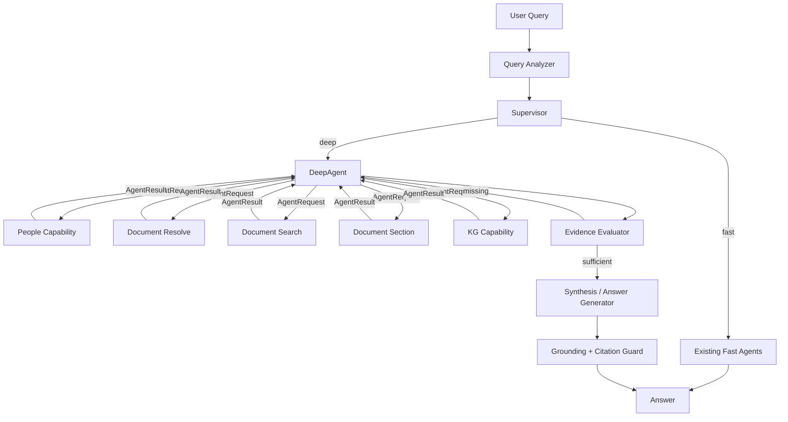

# AIRAG Agent Contract v1 — Nghiên cứu cải thiện LangGraph và tích hợp DeepAgent

**Trạng thái:** DRAFT / research design. Tài liệu này mô tả contract giao tiếp giữa Supervisor, DeepAgent và các capability/domain worker. Chưa phải chỉ thị triển khai runtime.

**Mục tiêu:** Chuẩn hóa cách các thành phần trong AIRAG giao tiếp khi xử lý câu hỏi đơn giản và phức tạp, đặc biệt với multi-step, multi-document, cross-agent và DeepAgent planning. Contract phải giữ rõ scope, quyền truy cập, provenance và trạng thái thiếu dữ liệu mà không buộc mọi component dùng chung toàn bộ `SupervisorState`.

**Liên quan:** `docs/deepagent-hybrid-proposal.md`, `backend/app/services/agents/models.py`, `backend/app/services/agent/state.py`.

---

## 1. Bối cảnh và vấn đề hiện tại

AIRAG hiện dùng LangGraph làm orchestration layer. Các node/agent chia sẻ nhiều trường qua `SupervisorState`, gồm query, workspace, document scope, retrieval sources, Mongo results, KG summaries, write inputs, task plan, retry, judge verdict và permission.

Cách này phù hợp khi graph còn nhỏ, nhưng bắt đầu tạo coupling khi thêm DeepAgent và các workflow đa bước:

- Supervisor, RAG, People, Resolve Doc và Answer Generator cùng phụ thuộc một state lớn.
- Một capability đơn giản như tra cứu người phải hiểu nhiều field thuộc orchestration.
- DeepAgent nếu gọi trực tiếp các node hiện tại sẽ phải giả lập `SupervisorState`, làm coupling tăng mạnh.
- `sources`, `mongo_results`, `kg_summaries` và `final_answer` hiện vừa là state runtime vừa được dùng như output ngầm giữa các agent.
- Multi-step cần biết bước nào còn thiếu evidence; `bool(sources)` không đủ mô tả task completion.
- Scope của query phức tạp cần thể hiện rõ: toàn workspace, một số document cụ thể, file upload là target, văn bản pháp lý là reference, hoặc cho phép discovery thêm reference.

Đề xuất: tách rõ hai tầng.

```text
LangGraph
= orchestration transport + state transitions + routing

AIRAG Agent Contract
= semantic interface giữa Supervisor / DeepAgent / capability
```

LangGraph State vẫn tồn tại, nhưng không còn là contract nghiệp vụ duy nhất giữa mọi component.

---

## 2. Nguyên tắc thiết kế

1. **Contract độc lập với executor.** Người gọi có thể là Supervisor, DeepAgent, subgraph hoặc worker khác; capability không cần biết caller là ai.
2. **Scope explicit.** Mỗi request/task phải biết workspace và document scope được phép truy cập.
3. **Child task chỉ được thu hẹp authorization scope.** Không tự mở rộng sang workspace/document ngoài parent scope nếu policy không cho phép.
4. **Target và reference là hai vai trò khác nhau.** File cần phân tích không đồng nghĩa với nguồn chuẩn dùng để đối chiếu.
5. **Permission không do LLM quyết định.** Tool exposure và service layer đều phải enforce quyền.
6. **Output có status chuẩn.** `success`, `partial`, `not_found`, `needs_input`, `denied`, `error` phải có semantics thống nhất.
7. **Evidence là first-class object.** Claim hoặc kết luận phải truy được về document/source cụ thể.
8. **Agent và Capability là hai khái niệm khác nhau.** Agent có reasoning/planning; capability cung cấp một khả năng nghiệp vụ có interface chặt.
9. **LangGraph `Command` không phải AgentResult.** AgentResult mô tả “đã xảy ra gì”; Command mô tả “đi đâu tiếp”.
10. **Contract versioned.** Thay đổi schema phá tương thích phải tăng version.

---

## 3. Phân biệt Agent và Capability

### Agent

Component có reasoning/planning hoặc điều phối nhiều bước.

Ví dụ:

- Supervisor
- DeepAgent
- Synthesis/Analysis agent nếu sau này tách riêng

### Capability

Khả năng chuyên biệt, ưu tiên deterministic hoặc bounded behavior.

Ví dụ:

- `people.lookup`
- `document.resolve`
- `document.search`
- `document.read_section`
- `document.summarize`
- `kg.query`
- `memory.search`

Không nên expose implementation detail như `mongo_search_name`, `mongo_search_cccd`, `search_section` cho DeepAgent nếu có thể gom chúng thành capability có schema tốt hơn.

---

## 4. Contract lõi đề xuất

### 4.1. `AgentRequest`

```python
from pydantic import BaseModel, Field
from typing import Any, Literal


class AgentRequest(BaseModel):
    contract_version: str = "1.0"

    request_id: str
    task_id: str
    parent_task_id: str | None = None

    capability: str
    objective: str

    inputs: dict[str, Any] = Field(default_factory=dict)

    scope: "ExecutionScope"
    context: "ExecutionContext"

    expected_output: str | None = None
```

Ý nghĩa:

- `request_id`: định danh toàn request người dùng.
- `task_id`: định danh task cụ thể trong plan.
- `parent_task_id`: liên kết task tree/DAG.
- `capability`: capability cần thực hiện.
- `objective`: mục tiêu nghiệp vụ ở ngôn ngữ rõ ràng.
- `inputs`: tham số nghiệp vụ.
- `scope`: phạm vi dữ liệu được phép truy cập.
- `context`: principal/session/permission đã xác minh.

`inputs` không được dùng thay cho scope. Ví dụ `document_ids` không nên bị nhét tùy ý vào query string hoặc prompt.

---

### 4.2. `ExecutionContext`

```python
class ExecutionContext(BaseModel):
    user_id: str | None = None
    session_id: str | None = None

    permissions: list[str] = Field(default_factory=list)

    language: str = "vi"

    trace_id: str | None = None
```

`ExecutionContext` chỉ chứa context đã được backend xác minh. LLM không được tự thêm permission.

Ví dụ:

```json
{
  "user_id": "user-123",
  "session_id": "session-456",
  "permissions": ["documents.read", "people.read"],
  "language": "vi"
}
```

---

## 5. Query scope: `workspace_ids` + document scope

### 5.1. Quy tắc nền

`workspace_ids` và `document_ids` cùng tạo thành retrieval scope của query/task.

```text
workspace_ids = [W1, W2]
document_ids = null
```

=> được tìm trong toàn bộ W1 và W2, nhưng vẫn phải qua ACL của user.

```text
workspace_ids = [W1]
document_ids = [D1, D2]
```

=> chỉ được tìm D1/D2 trong W1.

Conceptual rule:

```text
effective_scope
= user_permissions
  ∩ workspace_ids
  ∩ document_ids (nếu document_ids được chỉ định)
```

`workspace_ids` là authorization/retrieval boundary lớn hơn. `document_ids` là document-level narrowing.

---

### 5.2. Không dùng một `document_ids` duy nhất cho mọi semantics

Một query có thể vừa có target document vừa cần reference document.

Ví dụ user upload 2 file và hỏi:

> Kiểm tra nội dung hai file này có đúng với quy định A không.

Hai file upload là **target**; văn bản A là **reference**.

Nếu chỉ có:

```text
document_ids = [file1, file2]
```

thì không biểu diễn được việc phải đọc thêm A.

Do đó đề xuất scope đầy đủ:

```python
class ExecutionScope(BaseModel):
    workspace_ids: list[str] = Field(default_factory=list)

    # Tài liệu là SUBJECT của task/query.
    target_document_ids: list[str] = Field(default_factory=list)

    # Tài liệu đã được xác định là nguồn tham chiếu/căn cứ.
    reference_document_ids: list[str] = Field(default_factory=list)

    # Khi không có target/reference role cụ thể, document_ids có thể dùng
    # như document-level narrowing chung cho compatibility/fast-path.
    document_ids: list[str] | None = None

    reference_search_scope: Literal[
        "none",
        "workspace",
        "corpus",
    ] = "none"

    allow_reference_discovery: bool = False
```

### 5.3. Semantics đề xuất

- `workspace_ids`: vùng dữ liệu tối đa được caller cấp.
- `document_ids`: document narrowing chung; phù hợp query Q&A/summary đơn giản.
- `target_document_ids`: document cần phân tích, so sánh, kiểm tra hoặc tóm tắt.
- `reference_document_ids`: document dùng làm căn cứ/đối chiếu.
- `reference_search_scope`: nơi agent được phép tìm reference mới.
- `allow_reference_discovery`: có được resolve/search thêm reference ngoài `reference_document_ids` hay không.

Không nên cho child task tự thêm target document mới. Reference discovery chỉ hợp lệ nếu contract/policy cho phép.

---

### 5.4. Parent scope và child task scope

Ví dụ parent query:

> So sánh A, B, C.

Parent:

```json
{
  "workspace_ids": ["W1"],
  "target_document_ids": ["A", "B", "C"],
  "allow_reference_discovery": false
}
```

Planner có thể tạo:

```text
Task-A -> target_document_ids=[A]
Task-B -> target_document_ids=[B]
Task-C -> target_document_ids=[C]
```

Rule:

```text
Parent targets = [A,B,C]

child [A]        OK
child [A,B]      OK
child [D]        DENY
child all docs   DENY
```

Đối với reference:

```text
allow_reference_discovery=false
=> child không được tự search reference ngoài parent.

allow_reference_discovery=true
=> child có thể resolve/search reference trong reference_search_scope,
   nhưng không được vượt workspace/ACL.
```

---

## 6. `AgentResult`

Mọi capability/worker nên trả về một envelope thống nhất.

```python
class AgentResult(BaseModel):
    contract_version: str = "1.0"

    request_id: str
    task_id: str

    status: Literal[
        "success",
        "partial",
        "not_found",
        "needs_input",
        "denied",
        "error",
    ]

    data: dict[str, Any] | None = None

    evidence: list["Evidence"] = Field(default_factory=list)
    missing: list[str] = Field(default_factory=list)

    confidence: float | None = None

    scope_used: ExecutionScope | None = None

    error: "AgentError" | None = None
```

### Status semantics

#### `success`
Task hoàn thành đủ mục tiêu đã được giao trong scope.

#### `partial`
Có dữ liệu hữu ích nhưng chưa đủ hoàn thành objective. Bắt buộc mô tả phần thiếu trong `missing`.

#### `not_found`
Lookup/search đã chạy thành công trong scope nhưng không tìm thấy kết quả phù hợp. Không dùng `not_found` cho timeout hoặc backend outage.

#### `needs_input`
Thiếu dữ liệu từ user hoặc caller để tiếp tục, ví dụ có nhiều Nguyễn Văn A không phân giải được.

#### `denied`
Principal không có quyền thực hiện capability hoặc truy cập scope.

#### `error`
Infrastructure/runtime failure. Phải có error code có thể audit; không biến lỗi thành `not_found`.

---

## 7. Evidence contract

```python
class Evidence(BaseModel):
    evidence_id: str

    source_type: Literal[
        "document",
        "knowledge_graph",
        "people",
        "memory",
    ]

    role: Literal[
        "target",
        "reference",
        "supporting",
    ] = "supporting"

    document_id: str | None = None
    document_title: str | None = None

    section: str | None = None
    chunk_id: str | None = None

    content: str

    metadata: dict[str, Any] = Field(default_factory=dict)

    relevance: float | None = None
```

### Invariants

- `source_type=document` => `document_id` phải tồn tại.
- Evidence của comparison phải giữ document identity rõ ràng.
- `role=target` và `role=reference` không được mất khi fan-out/fan-in.
- Synthesizer không được đoán evidence thuộc văn bản nào dựa vào text.
- Citation layer có thể map `evidence_id` sang source marker/UI citation sau cùng.

---

## 8. Error contract

```python
class AgentError(BaseModel):
    code: Literal[
        "INVALID_INPUT",
        "SCOPE_VIOLATION",
        "PERMISSION_DENIED",
        "AMBIGUOUS_ENTITY",
        "DEPENDENCY_UNAVAILABLE",
        "TIMEOUT",
        "INTERNAL_ERROR",
    ]

    message: str
    retryable: bool = False
    details: dict[str, Any] = Field(default_factory=dict)
```

DeepAgent có thể dùng `retryable` để quyết định retry, nhưng backend vẫn phải có retry/deadline policy độc lập.

---

## 9. Capability descriptor

DeepAgent nên thấy capability-level interface thay vì implementation detail.

```python
class CapabilityDescriptor(BaseModel):
    name: str
    version: str
    description: str

    required_permissions: list[str] = Field(default_factory=list)

    cost_class: Literal[
        "cheap",
        "normal",
        "expensive",
    ] = "normal"

    supports_parallel: bool = False

    input_schema: dict[str, Any]
    output_schema: dict[str, Any]
```

Ví dụ:

```json
{
  "name": "people.lookup",
  "version": "1.0",
  "description": "Tra cứu cá nhân theo tên, CCCD, BHXH, điện thoại hoặc tiêu chí kết hợp",
  "required_permissions": ["people.read"],
  "cost_class": "cheap",
  "supports_parallel": true
}
```

DeepAgent không cần biết capability này dùng MongoDB hay collection nào.

---

## 10. Contract cho People capability

### Request

```json
{
  "contract_version": "1.0",
  "request_id": "req-1",
  "task_id": "person-lookup-1",
  "capability": "people.lookup",
  "objective": "Xác định Nguyễn Văn A và lấy định danh cần cho document research",
  "inputs": {
    "name": "Nguyễn Văn A"
  },
  "scope": {
    "workspace_ids": ["W1"],
    "document_ids": null,
    "target_document_ids": [],
    "reference_document_ids": [],
    "reference_search_scope": "none",
    "allow_reference_discovery": false
  },
  "context": {
    "user_id": "U1",
    "permissions": ["people.read", "documents.read"],
    "language": "vi"
  }
}
```

### Result

```json
{
  "contract_version": "1.0",
  "request_id": "req-1",
  "task_id": "person-lookup-1",
  "status": "success",
  "data": {
    "persons": [
      {
        "person_ref": "person-123",
        "name": "Nguyễn Văn A",
        "cccd": "012345678901"
      }
    ]
  },
  "evidence": [],
  "missing": [],
  "confidence": 1.0
}
```

### Permission rule

- Nếu user không có `people.read`, DeepAgent tốt nhất không được expose tool `people.lookup`.
- People service vẫn phải kiểm tra permission lần nữa trước khi query database.
- Không đưa logic permission chỉ vào prompt.

---

## 11. Ví dụ cross-agent: CCCD của A liên quan gì đến các nghị định?

User:

> Số căn cước công dân của Nguyễn Văn A có liên quan gì đến các nghị định?

Đây là query `cross_agent` vì document research phụ thuộc kết quả People lookup.

### Routing

```text
query_analyzer
    -> complexity=cross_agent
    -> execution_mode=deep
    -> capabilities=[people.lookup, document.search]

supervisor
    -> DeepAgent
```

### DeepAgent plan

```text
T1. people.lookup(name="Nguyễn Văn A")
T2. lấy CCCD từ T1
T3. document.search(query=<CCCD>, scope=<query scope>)
T4. document.search(query=<person name>, scope=<query scope>) nếu cần
T5. xác nhận kết quả thực sự liên quan cùng người
T6. tổng hợp mối liên hệ + evidence
```

T2/T3 là dependency; không nên chạy document search theo CCCD trước khi T1 resolve.

### Contract flow

```text
DeepAgent
   |
   +-- AgentRequest(capability=people.lookup)
   |        |
   |        +--> AgentResult(data.cccd=X)
   |
   +-- AgentRequest(capability=document.search, inputs.query=X)
            |
            +--> AgentResult(evidence=[...])

DeepAgent
   -> evaluate missing evidence
   -> synthesize
```

DeepAgent không cần gọi trực tiếp `people_agent_node()`.

---

## 12. Ví dụ multi-document: so sánh 2 hoặc N văn bản

User:

> So sánh Chương III của A với Chương II của B.

Parent scope:

```json
{
  "workspace_ids": ["W1"],
  "target_document_ids": ["A", "B"],
  "allow_reference_discovery": false
}
```

Planner tạo:

```text
Research-A -> target_document_ids=[A]
Research-B -> target_document_ids=[B]

Research-A ----+
               +--> comparison/synthesis
Research-B ----+
```

Nếu N document:

```text
Research-A -> [A]
Research-B -> [B]
Research-C -> [C]
...

fan-in -> synthesis
```

Mỗi task trả evidence giữ `document_id`, tránh gom tất cả vào một `sources[]` không biết provenance theo task.

---

## 13. Ví dụ target/reference: kiểm tra 2 file có đúng quy định A không

User upload F1, F2 rồi hỏi:

> Kiểm tra nội dung hai file này có đúng với quy định A không.

Scope:

```json
{
  "workspace_ids": ["W1"],
  "target_document_ids": ["F1", "F2"],
  "reference_document_ids": ["A"],
  "reference_search_scope": "none",
  "allow_reference_discovery": false
}
```

Plan:

```text
T1. extract requirements from A
T2. extract relevant content from F1
T3. extract relevant content from F2
T4. map F1/F2 against requirements
T5. report compliant / non_compliant / uncertain per requirement
```

Evidence:

```text
EV-A-1  role=reference document=A   section=Điều 8
EV-F1-1 role=target    document=F1  section=Mục 2
EV-F2-1 role=target    document=F2  section=Mục 4
```

Synthesis có thể tạo comparison matrix thay vì answer trực tiếp từ mixed sources.

---

## 14. Reference discovery

User:

> Kiểm tra hai file này có đúng các quy định hiện hành về thể thức văn bản hành chính không.

Không có reference document ID cụ thể.

Scope:

```json
{
  "workspace_ids": ["W1"],
  "target_document_ids": ["F1", "F2"],
  "reference_document_ids": [],
  "reference_search_scope": "workspace",
  "allow_reference_discovery": true
}
```

DeepAgent có thể:

```text
resolve/search relevant regulations
    -> validated reference_document_ids
    -> extract requirements
    -> evaluate F1/F2
```

Nhưng không được tự thêm F3 vào `target_document_ids`.

### Scope invariant

```text
TARGET SCOPE
= immutable trừ khi caller/user thay đổi.

REFERENCE SCOPE
= có thể dynamic nếu policy cho phép.
```

---

## 15. Supervisor vs DeepAgent routing contract

Query Analyzer nên trả không chỉ `intent_hint`, mà thêm execution semantics.

Đề xuất:

```python
class QueryAnalysis(BaseModel):
    complexity: Literal[
        "simple",
        "multi_doc",
        "multi_section",
        "cross_agent",
        "comparison",
    ]

    execution_mode: Literal[
        "fast",
        "deep",
        "clarify",
    ]

    required_capabilities: list[str]

    dependencies: list[dict] = Field(default_factory=list)

    scope: ExecutionScope
```

### Routing heuristic

`fast` khi pipeline hiện tại đã biết cách hoàn thành objective một cách bounded/deterministic.

Ví dụ:

- “CCCD của A là gì?” -> People fast path.
- “Tóm tắt Điều 5 của A” -> Resolve + RAG fast path.
- “Nghị định A quy định gì về X?” -> RAG fast path.

`deep` khi ít nhất một điều kiện xảy ra:

- phải thu thập riêng nhiều target rồi compare/synthesize;
- cross-capability;
- bước sau phụ thuộc dữ liệu runtime của bước trước;
- cần evaluate evidence rồi quyết định search tiếp;
- cần hierarchical/map-reduce summary;
- workflow đơn giản hiện tại không biểu diễn đầy đủ dependency.

Ví dụ:

- “CCCD của A xuất hiện trong nghị định nào?” -> DeepAgent.
- “So sánh A và B theo các nghĩa vụ liên quan X” -> DeepAgent.
- “Kiểm tra F1/F2 có đúng quy định A và nêu phần không phù hợp” -> DeepAgent.

---

## 16. LangGraph integration

### 16.1. State không phải contract

Không để capability đọc/ghi tùy ý toàn bộ `SupervisorState`.

Đề xuất adapter boundary:

```text
LangGraph State
      |
      | build_request()
      v
AgentRequest
      |
      v
Capability
      |
      v
AgentResult
      |
      | apply_result()
      v
LangGraph State
```

### 16.2. `Command` chỉ dùng cho orchestration

```python
result = await capability.execute(request)

if result.status == "success":
    return Command(
        update={"task_results": [result]},
        goto="deep_agent",
    )

if result.status == "needs_input":
    return Command(
        update={"clarification": result},
        goto="clarification",
    )
```

`AgentResult.status` không chứa `goto` vì capability không nên biết graph topology.

### 16.3. Fan-out

Multi-document task độc lập có thể dùng LangGraph `Send` hoặc DeepAgent subtask parallelism, nhưng mỗi branch phải nhận immutable task scope riêng.

```text
Parent Scope [A,B,C]

Send Research(A) -> scope [A]
Send Research(B) -> scope [B]
Send Research(C) -> scope [C]

fan-in -> evidence evaluator
```

---

## 17. Evidence evaluator

Contract cho phép thay `has_results = bool(sources)` bằng semantic completion check.

Đề xuất evaluator input:

```python
class TaskEvaluationInput(BaseModel):
    objective: str
    requirements: list[str]
    results: list[AgentResult]
```

Output:

```python
class TaskEvaluationResult(BaseModel):
    status: Literal[
        "sufficient",
        "insufficient",
        "contradictory",
        "needs_input",
    ]

    coverage: float
    missing: list[str]
    contradictions: list[str]
    suggested_capabilities: list[str]
```

DeepAgent có thể dùng `missing` để targeted retry.

Ví dụ:

```json
{
  "status": "insufficient",
  "coverage": 0.62,
  "missing": [
    "Quy định về ngoại lệ của văn bản B"
  ],
  "suggested_capabilities": [
    "document.read_section",
    "document.search"
  ]
}
```

---

## 18. Mapping từ state hiện tại sang contract

### Current -> Contract

```text
SupervisorState.workspace_ids
    -> ExecutionScope.workspace_ids

SupervisorState.document_ids
    -> ExecutionScope.document_ids
       hoặc target_document_ids tùy semantic context

SupervisorState.user_id
    -> ExecutionContext.user_id

SupervisorState.user_can_use_people
    -> permissions includes people.read

SupervisorState.sources
    -> Evidence[]

SupervisorState.mongo_results
    -> AgentResult.data

SupervisorState.kg_summaries
    -> AgentResult.data / Evidence(source_type=knowledge_graph)

SupervisorState.sub_queries
    -> DeepAgent plan/tasks hoặc QueryAnalysis dependencies

SupervisorState.accumulated_results
    -> task-scoped AgentResult[]
```

Không cần migrate toàn bộ ngay. Có thể dùng adapter để giữ compatibility với graph hiện tại trong pilot.

---

## 19. Đề xuất boundary cho DeepAgent pilot

DeepAgent pilot chỉ cần một số capability rõ ràng:

```text
people.lookup

document.resolve
document.search
document.read_section
document.list

kg.query
```

Không expose trực tiếp database drivers, Mongo collections, Neo4j session, vector DB client hoặc internal LangGraph node.

### Tool exposure theo permission

```text
if people.read:
    expose people.lookup
else:
    omit people.lookup
```

Service layer vẫn kiểm tra lại permission.

---

## 20. Streaming và progress

Worker/capability không nên tự stream final answer.

Nên chuẩn hóa progress event riêng:

```python
class AgentProgressEvent(BaseModel):
    request_id: str
    task_id: str

    event: Literal[
        "started",
        "searching",
        "resolved",
        "evaluating",
        "completed",
        "failed",
    ]

    detail: str | None = None
```

Chỉ outer synthesis/answer layer phát final answer token. Điều này tránh nhiều subagent cùng stream câu trả lời chồng nhau.

---

## 21. Observability và audit

Mỗi trace nên ghi được:

```text
request_id
  -> query analysis
  -> chosen execution_mode
  -> task_id / parent_task_id
  -> capability called
  -> scope requested
  -> scope actually used
  -> status
  -> evidence_ids
  -> latency
  -> retry/dependency failures
  -> synthesis result
```

Các metric nên thêm:

- fast/deep routing accuracy;
- capability selection accuracy;
- scope violation count;
- document resolution accuracy;
- evidence coverage;
- partial-result rate;
- unnecessary tool-call rate;
- cross-agent success rate;
- comparison completeness;
- final faithfulness/citation correctness;
- p50/p95 latency fast path vs deep path.

---

## 22. Các invariant bắt buộc khi triển khai

1. DeepAgent không được mở rộng `workspace_ids`.
2. Child task không được tự thêm `target_document_ids` ngoài parent scope.
3. Reference discovery phải đi qua explicit policy.
4. Không có permission -> capability không được expose và backend vẫn phải deny nếu bị gọi trực tiếp.
5. `not_found` chỉ dùng khi lookup hoàn thành trong scope.
6. Timeout/backend error không được biến thành `not_found`.
7. Mọi document evidence phải có `document_id`.
8. Synthesis không được mất mapping evidence -> task -> document.
9. Capability không điều khiển trực tiếp LangGraph topology.
10. Final answer chỉ được sinh sau khi evidence evaluator xác định đủ hoặc hệ thống trả lời rõ phần còn thiếu.

---

## 23. Hướng migration nghiên cứu

### Phase A — Contract models + adapters

- Định nghĩa Pydantic models cho request/result/scope/evidence/error.
- Không đổi routing hiện tại.
- Adapter People/RAG hiện tại sang contract.
- Log contract trong Langfuse để đánh giá.

### Phase B — DeepAgent pilot

- Thêm `deep` execution mode trong query analyzer/supervisor.
- DeepAgent dùng capability contract thay vì gọi node trực tiếp.
- Pilot trên comparison 2 document và cross-agent People -> RAG.
- Feature flag để fallback static/ReAct path hiện tại.

### Phase C — Evidence-driven execution

- Thêm task-scoped AgentResult.
- Semantic evidence evaluator.
- Targeted retry dựa trên `missing`.
- Fan-out multi-document khi task độc lập.

### Phase D — Simplify orchestration

- Giảm dần duplicated planning trong Supervisor.
- Giảm reliance vào `SupervisorState` làm universal interface.
- Đánh giá thay custom ReAct executor bằng DeepAgent complex path nếu benchmark tốt hơn.

---

## 24. Bộ query dùng để nghiên cứu contract

Nên benchmark contract với ít nhất các nhóm sau:

### Fast path

```text
CCCD của Nguyễn Văn A là gì?
Tóm tắt Điều 5 văn bản A.
Nghị định A quy định gì về X?
```

### Multi-document

```text
So sánh Chương II của A với Chương III của B.
So sánh A, B và C theo trách nhiệm của cơ quan quản lý.
```

### Cross-agent

```text
CCCD của Nguyễn Văn A xuất hiện trong nghị định nào?
Người có BHXH X có liên quan đến những văn bản nào trong workspace?
```

### Target/reference

```text
Kiểm tra hai file upload có đúng quy định A không.
Đối chiếu file F1 với A và B, chỉ ra các điểm không phù hợp.
```

### Reference discovery

```text
Kiểm tra hai file này có đúng các quy định hiện hành về thể thức văn bản hành chính không.
Kiểm tra A còn hiệu lực hay đã có văn bản thay thế rồi đánh giá file F1 theo quy định hiện hành.
```

### Scope safety

```text
User chỉ được scope [A,B] nhưng prompt yêu cầu lấy thêm D ngoài workspace.
DeepAgent tự đề xuất mở rộng target sang C dù parent target chỉ có A,B.
User không có people.read nhưng query yêu cầu CCCD.
```

---

## 25. Câu hỏi nghiên cứu cần trả lời bằng benchmark

Đây là các câu hỏi cần số liệu trước khi khóa implementation:

1. Query analyzer có phân loại `fast` vs `deep` ổn định hơn taxonomy intent hiện tại không?
2. Có cần LLM planner riêng hay DeepAgent `write_todos` đủ tốt cho pilot?
3. `document_ids` compatibility field có nên giữ lâu dài hay chuyển hoàn toàn sang target/reference scope?
4. Evidence evaluator nên rule-based + LLM judge hay một structured LLM judge duy nhất?
5. Cross-agent People -> RAG có cải thiện correctness đủ để bù latency DeepAgent không?
6. Multi-document fan-out tối đa bao nhiêu nhánh trước khi latency/context pressure tăng mạnh?
7. Có nên để DeepAgent synthesize final answer hay tiếp tục dùng AIRAG answer generator/citation layer?
8. DeepAgent có thể thay custom `react_executor` sau pilot hay hai path phục vụ use case khác nhau?
9. Contract có giúp giảm schema drift giữa `SupervisorState` và `AgentState` không?
10. `partial`/`missing` có cải thiện targeted retry và giảm hallucination so với `has_results` hiện tại không?

---

## 26. Kiến trúc mục tiêu dự kiến



### Guiding principle

```text
LangGraph quản lý workflow và lifecycle.
Supervisor chọn fast/deep route.
DeepAgent lập plan và điều phối complex research.
Capability thực hiện domain operation qua contract.
Evidence evaluator quyết định đã đủ căn cứ chưa.
Answer layer chịu trách nhiệm synthesis + citation cuối cùng.
```

---

## 27. Quyết định đề xuất cho v1

Để giữ YAGNI và giảm rủi ro, v1 nên khóa các điểm sau:

- Giữ `workspace_ids` là authorization boundary chính.
- Giữ `document_ids` để compatibility cho fast path và query scope đơn giản.
- Thêm `target_document_ids` và `reference_document_ids` cho complex path.
- Chỉ cho reference discovery khi `allow_reference_discovery=true`.
- Chuẩn hóa `AgentRequest`, `AgentResult`, `Evidence`, `ExecutionScope`, `ExecutionContext`, `AgentError`.
- DeepAgent gọi capability/tool adapters, không gọi trực tiếp LangGraph node hiện tại.
- People lookup là capability, không bắt buộc trở thành autonomous subagent.
- Child task scope phải là subset của parent authorization scope.
- Evidence phải giữ provenance theo `task_id` và `document_id`.
- Không rewrite toàn bộ graph trong phase đầu; dùng adapters + feature flag để benchmark.

Tài liệu này nên được dùng làm cơ sở cho bước tiếp theo: định nghĩa Pydantic schema cụ thể, adapter mapping với state hiện tại, query-router schema `fast/deep`, và bộ test contract trước khi tích hợp DeepAgent vào runtime.