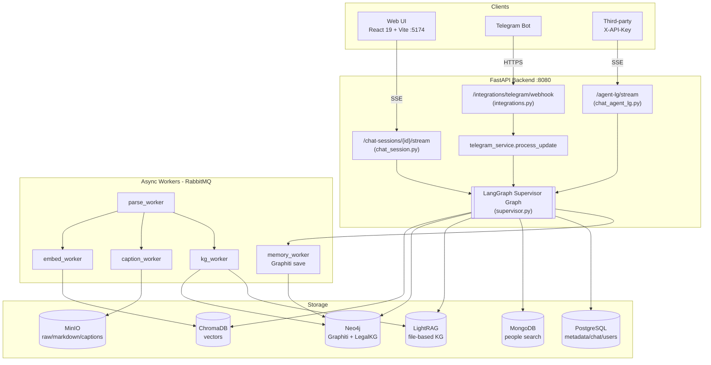
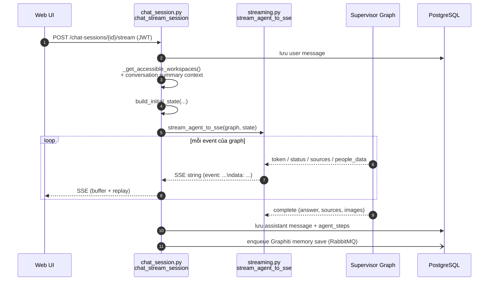
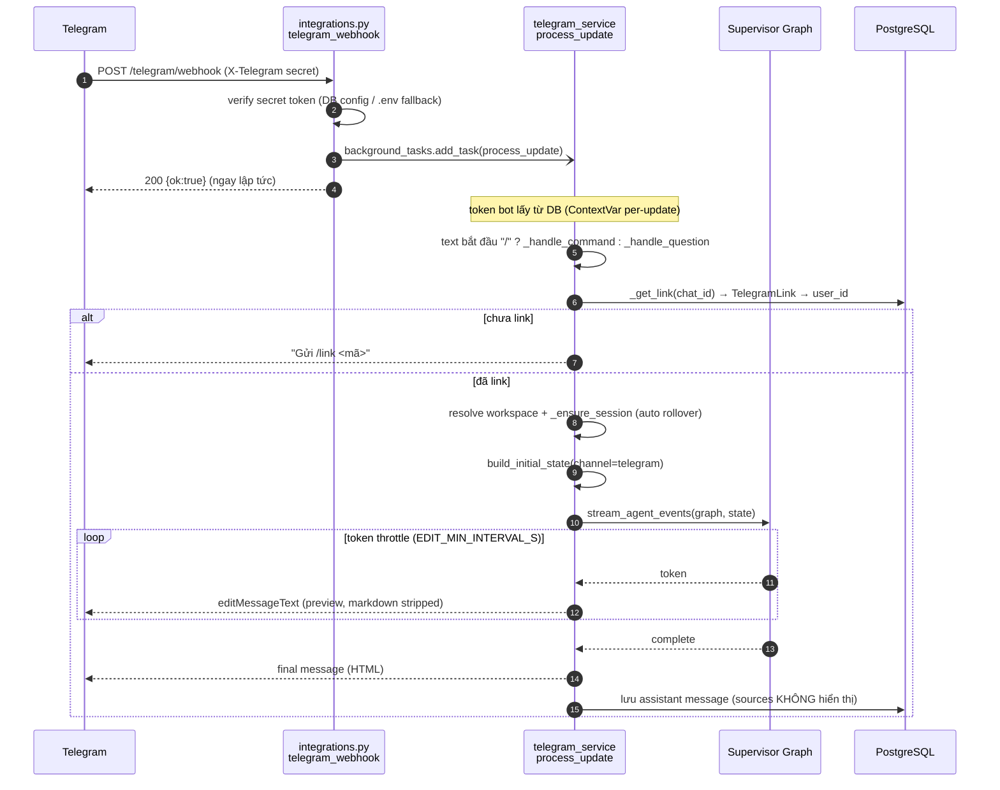
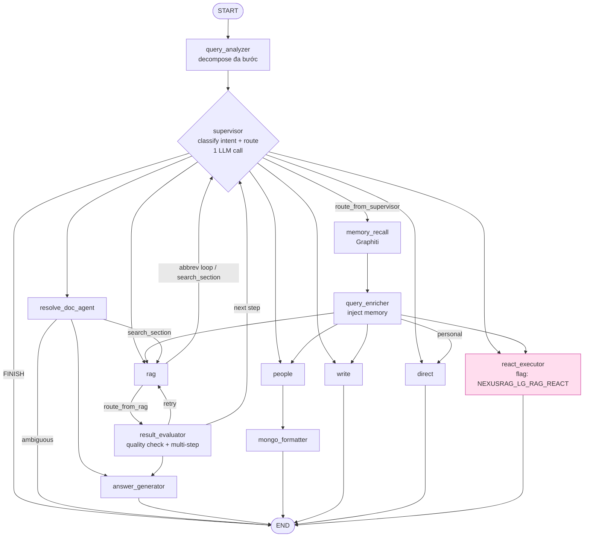

# AIRAG — Sơ đồ hệ thống

> Nguồn: đọc trực tiếp source (2026-06). LangGraph supervisor là **agent backend duy nhất**
> (web `chat_session.py` và Telegram `telegram_service.py` đều gọi `get_supervisor_graph()`).
> Lưu ý: `CLAUDE.md` còn ghi "legacy mặc định" — đã lỗi thời.

## 1. Kiến trúc tổng thể

## 2. Luồng Web → LangGraph (SSE streaming)

## 3. Luồng Telegram → LangGraph (in-process, không SSE)

**Khác biệt cốt lõi 2 kênh:** Web stream SSE ra trình duyệt; Telegram tiêu thụ
`stream_agent_events` **in-process** rồi throttle `editMessageText`. Auth: web = JWT;
Telegram = `secret_token` (chỉ chứng minh "từ Telegram") + `TelegramLink` (danh tính user thật).

## 4. Bên trong Supervisor Graph (nodes & edges)

**Ghi chú điều hướng:**
- `needs_memory=True` → đi qua `memory_recall → query_enricher` trước khi tới agent đích; ngược lại bypass thẳng.
- `resolve_doc` luôn vào `resolve_doc_agent` (hoặc `react_executor` nếu bật ReAct).
- Khi `NEXUSRAG_LG_RAG_REACT=true`, mọi nhánh `rag` được thay bằng `react_executor` (1 vòng tool-calling, terminal).
- Loop guard: `NEXUSRAG_LG_MAX_ITERATIONS` (mặc định 5–6); `result_evaluator` có thể quay lại `supervisor` cho bước kế tiếp.
