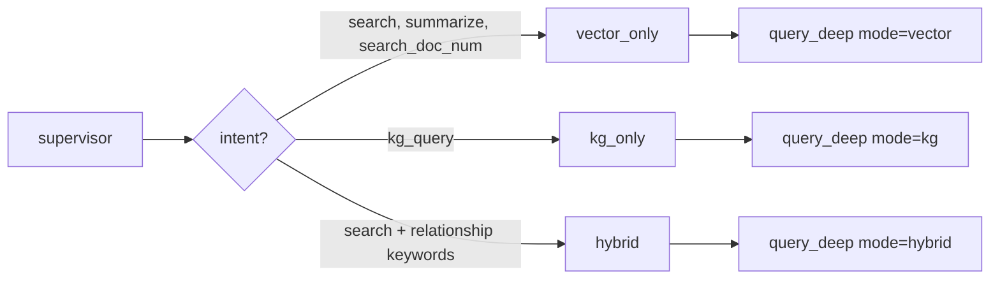
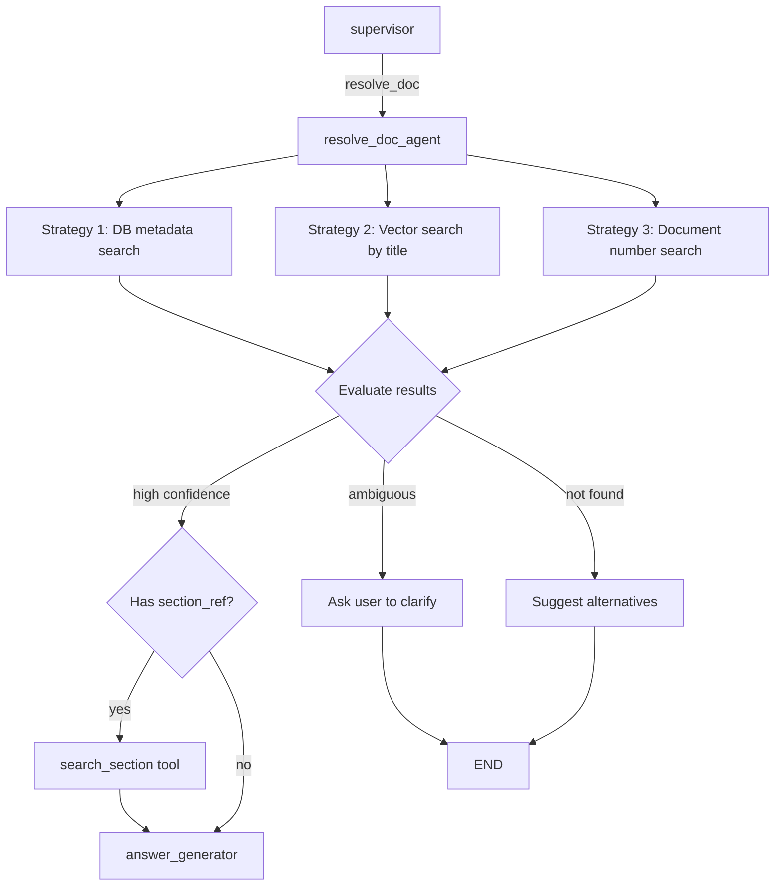
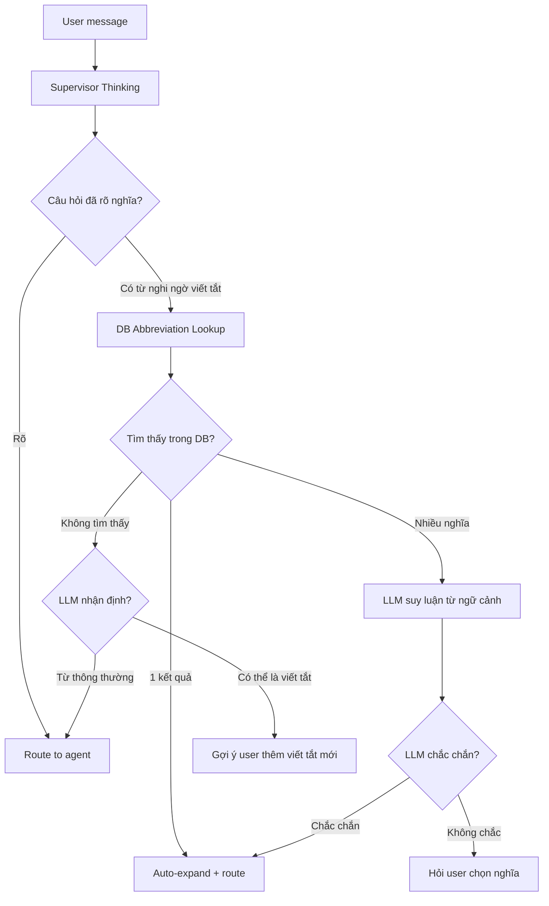

# Plan Cải Thiện LangGraph Agent System

## Tổng Quan

4 cải tiến chính cho hệ thống LangGraph supervisor multi-agent:

| # | Cải tiến | Mục tiêu | Độ phức tạp |
|---|----------|----------|-------------|
| 1 | **Smart RAG Search Routing** | Không phải câu hỏi nào cũng cần search KG | Trung bình |
| 2 | **Resolve Doc Agent** | Tách resolve_doc thành agent riêng | Cao |
| 3 | **Supervisor & Agent Thinking** | Thêm planning/reasoning cho supervisor và agent | Cao |
| 4 | **Query Clarification & Smart Abbreviation** | Làm rõ ý nghĩa câu hỏi, nhận diện viết tắt lowercase | Trung bình–Cao |

---

## Phase 1: Smart RAG Search Routing

### Vấn đề hiện tại

Hiện tại, `search_documents` trong `tools.py` gọi `_execute_search_documents` → `HRAGService.query_deep(mode="hybrid")` → **luôn chạy cả vector search + KG search**. Điều này lãng phí khi:

- Câu hỏi trích xuất thông tin ("Điều 5 quy định gì?") → chỉ cần **vector search**
- Câu hỏi tổng hợp ("Tóm tắt nội dung luật") → chỉ cần **vector search**
- Câu hỏi mối liên hệ ("Nghị định nào hướng dẫn Luật ANM?") → cần **KG search**

### Giải pháp: Intent-aware search mode



### Thay đổi cụ thể

#### 1.1. Thêm `search_mode` vào `SupervisorState`
**File:** `backend/app/services/agents/models.py`

#### 1.2. Supervisor quyết định search_mode
**File:** `backend/app/services/agents/supervisor.py` — trong `supervisor_node()`

#### 1.3. RAG agent truyền search_mode xuống tool
**File:** `backend/app/services/agents/rag_agent.py` — `_tool_search()`

#### 1.4. `search_documents` tool nhận search_mode
**File:** `backend/app/services/agent/tools.py`

#### 1.5. `_execute_search_documents` truyền mode xuống `query_deep`
**File:** `backend/app/api/chat_agent.py`

---

## Phase 2: Resolve Doc Agent

### Vấn đề hiện tại

`resolve_doc` hiện là 1 tool trong RAG agent:

1. Chỉ chạy **1 lần** duy nhất (không có khả năng retry/refine)
2. Khi không tìm thấy → trả về message "không tìm thấy"
3. Không thể kết hợp nhiều chiến lược search (tên + số + nội dung)
4. Không có khả năng **hỏi lại user** khi ambiguous

### Giải pháp: Tách thành agent riêng với multi-strategy search



### Thay đổi cụ thể

#### 2.1. Thêm `AgentType.RESOLVE_DOC`
**File:** `backend/app/services/agents/models.py`

#### 2.2. Tạo file mới: `resolve_doc_agent.py`
**File mới:** `backend/app/services/agents/resolve_doc_agent.py`

#### 2.3. Cập nhật supervisor graph
**File:** `backend/app/services/agents/supervisor.py`

#### 2.4. Routing function cho resolve_doc
Thêm hàm điều hướng sau khi resolve_doc hoàn thành.

#### 2.5. Loại bỏ resolve_doc khỏi RAG registry
**File:** `backend/app/services/agents/rag_agent.py`

---

## Phase 3: Supervisor & Agent Thinking

### Vấn đề hiện tại

1. **Supervisor** chỉ classify intent + route → không có khả năng **lên plan** cho câu hỏi phức tạp.
2. **Agent** chỉ gọi tool → nhận kết quả → không có khả năng **đánh giá** chất lượng kết quả.
3. **Answer Generator thinking** chỉ lặp lại dữ liệu từ source → không mang lại giá trị suy luận thực sự.

### Giải pháp: Thinking + Planning

#### 3A. Supervisor Planning
Thêm `thinking` output để phân tích câu hỏi và lên plan xử lý.

#### 3B. Agent Result Evaluation
Thêm evaluation step trong RAG agent để đánh giá tool result trước khi trả về.

#### 3C. Answer Generator Thinking — Hướng dẫn suy luận có mục đích

### Thay đổi cụ thể

#### 3.1. Thêm state fields
**File:** `backend/app/services/agents/models.py` (`supervisor_plan`, `agent_evaluation`, v.v.)

#### 3.2. Cập nhật Supervisor Prompt
Output thêm `thinking` và `plan`.

#### 3.3. Parse & emit thinking từ supervisor
**File:** `backend/app/services/agents/supervisor.py`

#### 3.4. Agent Result Evaluation trong RAG agent
Thêm logic đánh giá nguồn dữ liệu tìm thấy.

#### 3.5. Logic loop back
Nếu kết quả không đủ (`insufficient`), supervisor sẽ nhận lại để đổi strategy.

#### 3.6. Answer Generator Thinking — Giải quyết vấn đề "thinking chỉ lặp lại source"

##### Phân tích vấn đề hiện tại

Trong `nodes.py` (L481–L797), answer_generator bật thinking dựa vào số lượng source:
- `source_count < 5` → **tắt thinking** (giảm latency)
- `source_count >= 5` → **bật thinking** (cần tổng hợp phức tạp)

Khi thinking được bật, LLM (Claude) tự do suy nghĩ nhưng **không có hướng dẫn cụ thể** nên chỉ lặp lại nội dung source. Nguyên nhân:
- Prompt hiện tại (`chat.py` + `answer_instructions.py`) không có section nào hướng dẫn thinking
- LLM nhận context dài (nhiều source) → thinking mặc định = tóm tắt lại context
- Không có yêu cầu đánh giá, so sánh, hay lập luận logic

##### Giải pháp: Structured Thinking Directive

Inject hướng dẫn thinking vào prompt **chỉ khi thinking được bật**, yêu cầu LLM thực hiện các bước suy luận có mục đích thay vì tóm tắt source.

**File:** `backend/app/prompts/agents/answer_instructions.py`

Thêm section mới `_THINKING_DIRECTIVE`:

```python
_THINKING_DIRECTIVE = (
    "\n## Thinking Process (khi extended thinking được bật)\n"
    "Trong phần thinking, bạn PHẢI thực hiện các bước suy luận sau. "
    "KHÔNG được lặp lại nội dung source — thay vào đó, hãy PHÂN TÍCH chúng:\n\n"
    
    "1. **Đánh giá nguồn (Source Triage):** Nguồn nào thực sự liên quan đến câu hỏi? "
    "Nguồn nào chỉ liên quan gián tiếp hoặc không liên quan? "
    "Ghi nhận ID nguồn quan trọng nhất.\n\n"
    
    "2. **Phát hiện mâu thuẫn/lỗ hổng:** Các nguồn có mâu thuẫn không? "
    "Có thông tin nào bị thiếu mà câu hỏi yêu cầu? "
    "Có nguồn nào cung cấp thông tin cũ/lỗi thời không?\n\n"
    
    "3. **Lập luận & suy diễn:** Câu hỏi yêu cầu trích xuất trực tiếp hay tổng hợp? "
    "Cần so sánh giữa các nguồn hay kết hợp thông tin? "
    "Có thể rút ra kết luận logic nào từ nhiều nguồn?\n\n"
    
    "4. **Lên kế hoạch câu trả lời:** Cấu trúc câu trả lời nên như thế nào? "
    "(danh sách, bảng so sánh, giải thích từng bước, v.v.) "
    "Thứ tự trình bày nào logic nhất cho user?\n\n"
    
    "5. **Tự kiểm tra:** Câu trả lời có đầy đủ? Có bỏ sót phần nào của câu hỏi? "
    "Citation có chính xác không?\n\n"
    
    "⚠️ TUYỆT ĐỐI KHÔNG copy/paste nội dung source vào thinking. "
    "Thinking phải là QUÁ TRÌNH SUY LUẬN, không phải bản tóm tắt.\n"
)
```

**Cách inject:** Trong `answer_generator` (`nodes.py`), thêm thinking directive vào prompt chỉ khi `enable_thinking=True`:

```python
# Trong answer_generator(), trước khi build inject string:
intent_instructions = get_instructions_for_intent(intent)
if enable_thinking:
    intent_instructions += _THINKING_DIRECTIVE
```

##### Ví dụ thinking trước vs sau

**TRƯỚC (thinking vô ích — lặp lại source):**
```
<think>
Source [ab12] nói về Điều 5 Luật An ninh mạng quy định nguyên tắc bảo vệ 
an ninh mạng bao gồm: tuân thủ Hiến pháp và pháp luật, bảo đảm quyền...
Source [cd34] nói về Điều 6 quy định các hành vi bị cấm trên không gian mạng...
Source [ef56] nói về trách nhiệm của cơ quan nhà nước trong bảo vệ an ninh mạng...
</think>
```

**SAU (thinking có giá trị — phân tích & lập luận):**
```
<think>
1. Source triage: [ab12] và [cd34] trực tiếp liên quan đến câu hỏi về "nguyên tắc bảo vệ ANTT".
   [ef56] liên quan gián tiếp (trách nhiệm cơ quan). Ưu tiên [ab12] và [cd34].

2. Mâu thuẫn: Không có mâu thuẫn. Tuy nhiên [ab12] từ Luật 2018, cần kiểm tra 
   nếu có sửa đổi trong [cd34] (Nghị định 2020).

3. Lập luận: Câu hỏi yêu cầu liệt kê nguyên tắc → trích xuất trực tiếp từ [ab12].
   Nên bổ sung các hành vi cấm từ [cd34] vì liên quan chặt chẽ.

4. Cấu trúc: Mở đầu tóm tắt → liệt kê nguyên tắc (bullet points) → 
   hành vi cấm (bảng) → kết luận ngắn.

5. Kiểm tra: Câu hỏi hỏi "nguyên tắc" — đã bao phủ đầy đủ. Citation chính xác.
</think>
```

##### Tinh chỉnh khi nào bật/tắt thinking

Logic hiện tại (`source_count >= 5`) khá thô. Cải thiện:

```python
# Bật thinking khi CẦN suy luận phức tạp, không chỉ dựa trên số source
should_think = False

if source_count >= 5:
    should_think = True  # Nhiều nguồn → cần triage
elif intent in {"kg_query", "summarize"}:
    should_think = True  # KG/tóm tắt luôn cần suy luận
elif len(rewritten_query) > 100:
    should_think = True  # Câu hỏi phức tạp (dài)
    
# Nhưng tắt cho các intent đơn giản dù nhiều source
if intent in {"search_abbr", "list_docs", "search_doc_num"}:
    should_think = False  # Trả lời trực tiếp, không cần suy luận

enable_thinking = should_think
```

##### Files bị ảnh hưởng (3.6)

| File | Thay đổi |
|------|----------|
| `prompts/agents/answer_instructions.py` | Thêm `_THINKING_DIRECTIVE` |
| `services/agent/nodes.py` | Inject thinking directive, cải thiện logic bật/tắt thinking |

---

## Phase 4: Query Clarification & Smart Abbreviation Detection

### Vấn đề hiện tại

#### A. Nhận diện viết tắt lowercase
Người dùng thường viết tắt dạng **lowercase**: `"bmnn ttgt ntn"` thay vì `"BMNN TTGT ntn"`.

Hệ thống hiện tại có 2 lớp xử lý viết tắt, nhưng cả hai đều có vấn đề:

1. **`_expand_abbreviations_in_message()`** trong `supervisor.py` (L154–L237):
   - Regex `r'\b([a-z]{2,})\b'` bắt **tất cả từ lowercase ≥ 2 ký tự** → quá greedy
   - Mọi từ tiếng Việt bình thường ("của", "theo", "trong") đều match → query DB lớn, nhiễu, chậm
   - Không phân biệt được từ viết tắt thật sự vs từ thông thường

2. **`_tool_search_abbr()`** trong `rag_agent.py` (L185–L287):
   - Regex `r'\b([A-Z]{2,})\b'` → chỉ bắt **uppercase** → hoàn toàn bỏ qua `"bmnn"`, `"ttgt"`
   - Fallback search raw_query khi không tìm thấy uppercase match, nhưng search cả câu thì kém chính xác

#### B. Không làm rõ ý nghĩa câu hỏi trước khi xử lý
Supervisor hiện tại không có bước "hiểu câu hỏi" trước khi route:
- Nếu câu hỏi chứa thuật ngữ viết tắt không rõ → vẫn route bình thường → kết quả search sai
- Không có khả năng hỏi lại user: "Bạn có ý nói BMNN là Bảo mật nội ngoại hay Bảo mật nông nghiệp?"

### Giải pháp: LLM-based Abbreviation Detection + Query Clarification

Tích hợp vào **Phase 3 (Thinking)** — supervisor thinking bao gồm luôn bước nhận diện từ nghi ngờ viết tắt.



### Thay đổi cụ thể

#### 4.1. Thay thế regex bằng LLM-based detection trong supervisor thinking

Thay vì dùng regex `r'\b([a-z]{2,})\b'` (bắt tất cả), sử dụng LLM (memory agent/Qwen3-4B) để xác định token nào có khả năng là viết tắt.

**Prompt cho LLM detection:**
```
Phân tích câu sau và xác định các từ có thể là viết tắt (abbreviation):
"{user_message}"

Quy tắc:
- Từ viết tắt thường là chuỗi consonant liền (bmnn, ttgt, anm) hoặc uppercase (BMNN)
- Từ viết tắt thường không có nguyên âm hoặc rất ít nguyên âm
- Loại bỏ các từ thông thường: của, theo, trong, như, ntn (như thế nào), v.v.
- Chỉ trả về từ nghi ngờ là viết tắt chuyên ngành

Output JSON: {"suspected_abbreviations": ["bmnn", "ttgt"], "confidence": "high"|"medium"|"low"}
```

**Kết hợp Phase 3 (Thinking):** LLM detection chạy như một phần của supervisor thinking — không cần LLM call riêng.

Supervisor prompt mở rộng:
```json
{
  "thinking": "User hỏi về 'bmnn ttgt'. 'bmnn' và 'ttgt' có vẻ là viết tắt (không có nguyên âm, chuỗi consonant).",
  "suspected_abbreviations": ["bmnn", "ttgt"],
  "plan": "1. Tra cứu viết tắt bmnn, ttgt. 2. Expand rồi search.",
  "next_agent": "rag",
  "intent": "search_abbr"
}
```

#### 4.2. Cải thiện `_expand_abbreviations_in_message()` — hybrid approach

**File:** `backend/app/services/agents/supervisor.py`

Thay regex greedy bằng heuristic thông minh hơn + LLM fallback:

```python
def _is_likely_abbreviation(word: str) -> bool:
    """Heuristic: từ có khả năng là viết tắt nếu:
    1. Toàn uppercase (BMNN, TTGT) → chắc chắn
    2. Lowercase nhưng ít/không nguyên âm (bmnn, ttgt, ntn) → có thể
    3. Loại trừ stop words tiếng Việt
    """
    if word.isupper() and len(word) >= 2:
        return True  # Chắc chắn là viết tắt
    
    # Vietnamese stop words — KHÔNG phải viết tắt
    STOP_WORDS = {
        "là", "và", "của", "có", "cho", "này", "đó", "với",
        "các", "được", "theo", "trong", "về", "từ", "đến",
        "khi", "nào", "như", "hay", "hoặc", "nếu", "thì",
        "sẽ", "đã", "đang", "tôi", "bạn", "anh", "chị",
        "gì", "ntn", "nào", "sao", "thế",
    }
    if word.lower() in STOP_WORDS:
        return False
    
    # Heuristic: tỷ lệ nguyên âm thấp → khả năng cao là viết tắt
    vowels = set("aeiouyàáảãạăắằẳẵặâấầẩẫậèéẻẽẹêếềểễệìíỉĩịòóỏõọôốồổỗộơớờởỡợùúủũụưứừửữựỳýỷỹỵ")
    vowel_count = sum(1 for c in word.lower() if c in vowels)
    vowel_ratio = vowel_count / len(word) if word else 1
    
    # Ít hơn 20% nguyên âm và >= 2 ký tự → có thể là viết tắt
    if len(word) >= 2 and vowel_ratio < 0.2:
        return True
    
    return False
```

#### 4.3. Tích hợp vào supervisor thinking output

Khi supervisor thinking phát hiện từ nghi ngờ viết tắt:

1. **Auto-lookup DB**: query bảng `Abbreviation` với `ilike` cho mỗi từ nghi ngờ
2. **Tìm thấy 1 nghĩa** → tự động expand, ghi vào `rewritten_query`
3. **Tìm thấy nhiều nghĩa** → **LLM context disambiguation** (xem 4.3.1 bên dưới)
4. **Không tìm thấy** → emit event `potential_abbreviations` (logic đã có), tiếp tục xử lý bình thường

#### 4.3.1. LLM Context Disambiguation — Suy luận nghĩa viết tắt từ ngữ cảnh

Khi 1 viết tắt có nhiều nghĩa trong DB (ví dụ: "ANM" = "An ninh mạng" hoặc "An ninh môi trường"), LLM cần **suy luận nghĩa đúng dựa trên ngữ cảnh câu hỏi** trước khi hỏi user.

**Ví dụ:**
- User hỏi: `"anm có quy định gì về bảo vệ dữ liệu cá nhân?"` → Ngữ cảnh "dữ liệu cá nhân" → ANM = **An ninh mạng** (chắc chắn)
- User hỏi: `"anm là gì?"` → Không có ngữ cảnh đủ rõ → **Hỏi user**

**Cách triển khai:** Tích hợp vào supervisor thinking prompt — khi DB trả về nhiều nghĩa, inject danh sách nghĩa vào prompt để LLM chọn:

```python
async def _disambiguate_abbreviation(
    abbr: str,
    meanings: list[dict],  # [{"full_form": "An ninh mạng", "description": "..."}, ...]
    user_message: str,
    chat_history: list[dict],
) -> dict:
    """LLM suy luận nghĩa viết tắt từ ngữ cảnh.
    
    Returns:
        {"chosen": "An ninh mạng", "confidence": "high"|"low", "reasoning": "..."}
    """
    meanings_text = "\n".join(
        f"  {i+1}. {m['full_form']}" + (f" — {m['description']}" if m.get('description') else "")
        for i, m in enumerate(meanings)
    )
    
    prompt = f"""Từ viết tắt "{abbr}" có các nghĩa sau:
{meanings_text}

Câu hỏi của user: "{user_message}"

Dựa vào ngữ cảnh câu hỏi, hãy chọn nghĩa phù hợp nhất.
Nếu ngữ cảnh không đủ rõ để chọn, trả về confidence: "low".

Output JSON: {{"chosen": "<full_form>", "confidence": "high"|"low", "reasoning": "<1 câu giải thích>"}}"""
    
    # Sử dụng memory agent (Qwen3-4B) — nhanh, rẻ
    result = await _call_memory_agent(prompt, max_tokens=100)
    return result
```

**Flow xử lý kết quả disambiguation:**

| Kết quả | Hành động |
|---------|----------|
| `confidence: "high"` | Auto-expand với nghĩa LLM chọn, emit thinking event giải thích lý do |
| `confidence: "low"` | Hỏi user chọn nghĩa, kèm danh sách các nghĩa có thể |

**Ví dụ thinking output khi LLM tự disambiguate được:**
```json
{
  "thinking": "'anm' có 2 nghĩa: An ninh mạng, An ninh môi trường. Ngữ cảnh 'bảo vệ dữ liệu cá nhân' chỉ rõ đây là An ninh mạng.",
  "abbreviation_resolution": {
    "anm": {"chosen": "An ninh mạng", "confidence": "high"}
  },
  "plan": "Expand 'anm' → 'An ninh mạng', rồi search.",
  "next_agent": "rag",
  "intent": "search"
}
```

**Ví dụ khi LLM không chắc chắn:**
```json
{
  "thinking": "'anm' có 2 nghĩa: An ninh mạng, An ninh môi trường. Câu hỏi 'anm là gì' không đủ ngữ cảnh để chọn.",
  "abbreviation_resolution": {
    "anm": {"chosen": null, "confidence": "low"}
  },
  "clarification_needed": true,
  "clarification_message": "'ANM' có thể là:\n1. An ninh mạng\n2. An ninh môi trường\nBạn muốn hỏi về nghĩa nào?"
}
```

#### 4.4. Cập nhật `_tool_search_abbr()` hỗ trợ case-insensitive

**File:** `backend/app/services/agents/rag_agent.py`

```python
# BEFORE: chỉ bắt uppercase
all_abbr_matches = re.findall(r'\b([A-Z]{2,})\b', raw_query)

# AFTER: bắt cả lowercase bằng heuristic
all_tokens = re.findall(r'\b(\w{2,})\b', raw_query)
all_abbr_matches = [t for t in all_tokens if _is_likely_abbreviation(t)]
```

#### 4.5. Thêm state field cho clarification flow

**File:** `backend/app/services/agents/models.py`

```python
class SupervisorState(TypedDict, total=False):
    # ... existing fields ...
    suspected_abbreviations: list[str]   # Từ nghi ngờ viết tắt (từ thinking)
    clarification_needed: bool            # Cần hỏi user thêm thông tin
    clarification_message: str            # Nội dung câu hỏi clarification
```

### Files bị ảnh hưởng (Phase 4)

| File | Thay đổi |
|------|----------|
| `services/agents/supervisor.py` | Cải thiện `_expand_abbreviations_in_message()`, tích hợp vào thinking |
| `services/agents/rag_agent.py` | `_tool_search_abbr()` hỗ trợ case-insensitive matching |
| `services/agents/models.py` | Thêm `suspected_abbreviations`, `clarification_needed`, `clarification_message` |
| `prompts/agents/supervisor_prompt.py` | Thêm `suspected_abbreviations` vào output format |

### Lưu ý khi triển khai

- Phase 4 **phụ thuộc Phase 3** (Thinking): logic nhận diện viết tắt nằm trong thinking output
- Heuristic nguyên âm hoạt động tốt với viết tắt tiếng Việt (BMNN → 0% vowels, TTGT → 0%)
- Cần **whitelist** các từ thông thường 2 ký tự ("đi", "về", "ra") để tránh false positive
- LLM detection chỉ cần chạy khi heuristic không chắc chắn (vowel_ratio 20-40%)

---

## Thứ tự triển khai đề xuất

1. **Phase 1 (Smart RAG Routing):** Đơn giản nhất, tối ưu performance ngay.
2. **Phase 3 + 4 (Thinking + Query Clarification):** Triển khai cùng nhau vì Phase 4 là một phần của thinking. Tăng khả năng hiểu câu hỏi trước khi xử lý.
3. **Phase 2 (Resolve Doc Agent):** Phức tạp nhất, thay đổi cấu trúc graph.
