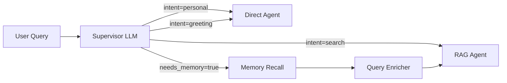
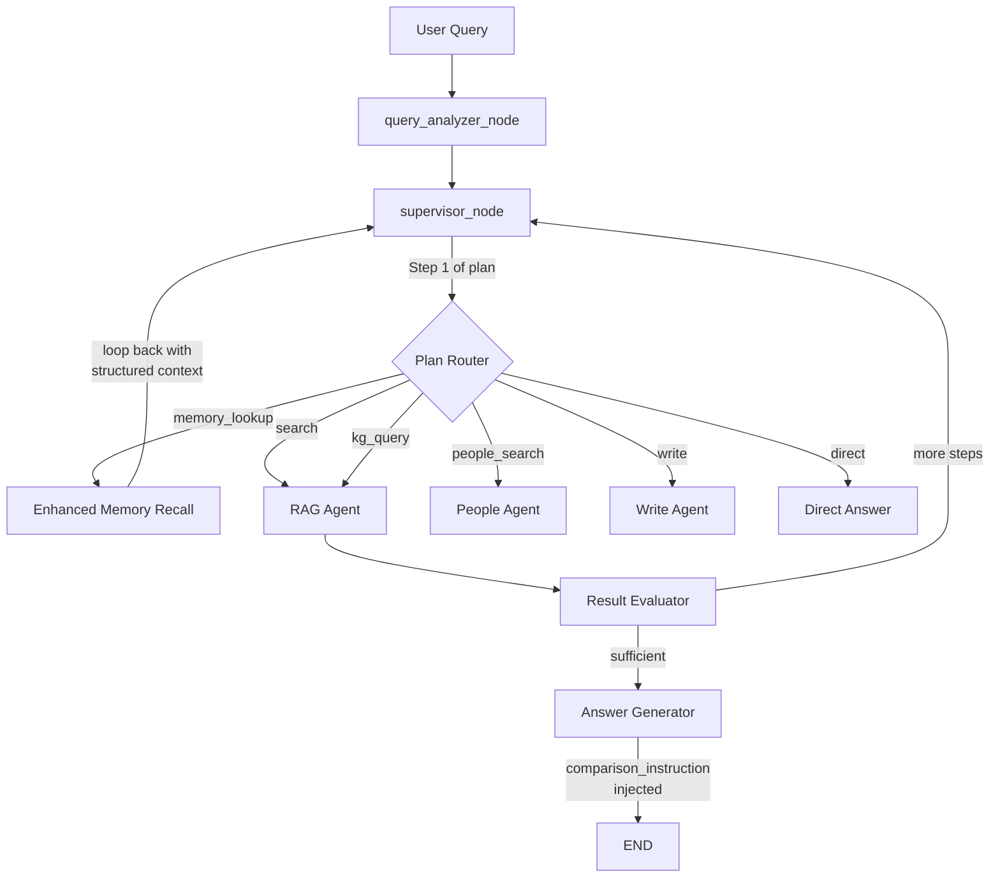

# Review: Tool-Aware Planning cho LangGraph Supervisor

## Tóm tắt

Đã review [tool_aware_planning_plan.md](file:///home/AIRAG/docs/tool_aware_planning_plan.md) cùng với kiến trúc hiện tại trong [supervisor.py](file:///home/AIRAG/backend/app/services/agents/supervisor.py). Bên dưới là phân tích chi tiết các vấn đề và đề xuất hướng nâng cấp.

---

## Phân Tích Kiến Trúc Hiện Tại

### Vấn đề cốt lõi: Supervisor "không nhận thức" tool/capability

Hiện tại, supervisor hoạt động theo mô hình **Intent Classification → Fixed Routing**:



Vấn đề:
1. **Intent taxonomy cứng nhắc**: 16 intent types được hardcode, LLM chỉ pick 1 intent → map đến 1 agent
2. **Memory recall binary**: `needs_memory=true/false` — không có khả năng **conditional**: "lấy memory rồi dùng kết quả để quyết định bước tiếp theo"
3. **task_plan chỉ là prerequisite chain**: `["resolve_doc", "search"]` — không phải dynamic planning dựa trên runtime context
4. **Query enricher chỉ rewrite text**: Thay "tôi" → "Công an tỉnh X", nhưng không extract structured facts để inform routing

### Vấn đề cụ thể mà plan đang giải quyết

Query: *"Thiết bị máy tính của tôi có sử dụng được để soạn thảo tài liệu BMNN không?"*

Flow hiện tại:
```
supervisor → intent=search, needs_memory=true
  → memory_recall (lấy free-text facts)
  → query_enricher (rewrite "tôi" → concrete org)
  → rag (search BMNN) → answer_generator
```

**Thiếu**: Memory chứa "MacBook Pro M3" nhưng answer_generator không biết cần **SO SÁNH** device spec vs. BMNN requirements.

---

## Review Plan: Điểm Mạnh

| # | Điểm mạnh | Đánh giá |
|---|-----------|----------|
| 1 | **Reuse existing primitives**: `should_loop_back`, `search_user_memory`, `get_memory_agent` | ✅ Đúng — không reinvent |
| 2 | **Backward compatible**: `task_plan` giữ format `list[str]`, thêm intent name mới | ✅ Giữ ổn định |
| 3 | **Structured profile extraction**: `_extract_user_profile()` → `{device, os, org, ...}` | ✅ Giá trị cao — hiện tại memory chỉ là free-text |
| 4 | **Loop-back pattern**: `user_info_lookup` → supervisor re-plan | ✅ Reuse pattern đã proven (abbreviation expansion) |
| 5 | **Graceful degradation**: Không có device fact → fallback generic answer | ✅ Không phá flow cũ |

---

## Review Plan: Các Vấn Đề Cần Giải Quyết

### ⚠️ Vấn đề 1: Overfitting — Giải pháp quá hẹp cho 1 use case

Plan tạo `user_info_lookup` intent + node **chỉ** để xử lý pattern *"X của tôi có Y không?"*. Nhưng vấn đề thực sự rộng hơn:

| Query pattern | Cần gì ngoài RAG | Plan hiện tại xử lý? |
|---|---|---|
| "Thiết bị của tôi có dùng để soạn BMNN không?" | Device info → compare | ✅ |
| "Đơn vị tôi có đủ điều kiện triển khai ANM không?" | Org info → check requirements | ❌ (needs different fields) |
| "So sánh thiết bị của tôi với yêu cầu NĐ 83" | Device + doc resolve + compare | ❌ (3-step plan needed) |
| "Tìm người phụ trách ANM tại đơn vị tôi" | Org info → people search | ❌ (cross-agent plan) |
| "Thiết bị nào trong đơn vị tôi đáp ứng BMNN?" | Multiple device facts + RAG | ❌ |

> **Kết luận**: `user_info_lookup` là bandaid cho 1 pattern. Nếu tiếp tục approach này, mỗi pattern mới sẽ cần thêm 1 intent + 1 node.

### ⚠️ Vấn đề 2: Trùng lặp với Memory Recall

Luồng plan đề xuất:
```
supervisor → user_info_lookup → search_user_memory() → _extract_user_profile()
                                    → loop back → supervisor → rag
```

Luồng **đã có**:
```
supervisor (needs_memory=true) → memory_recall → search_user_memory()
                               → query_enricher → rag
```

Cả hai đều gọi `search_user_memory()` từ Graphiti. Sự khác biệt duy nhất:
- **Memory recall**: Trả free-text → enricher rewrite query
- **user_info_lookup**: Trả free-text → extract structured profile → enricher rewrite + inject profile

**Rủi ro**: 2 paths gọi Graphiti — khi `needs_memory=true` VÀ `task_plan[0]=user_info_lookup`, cả hai đều chạy → duplicate latency.

### ⚠️ Vấn đề 3: Prompt TOOL REGISTRY quá hẹp

Plan thêm TOOL REGISTRY vào supervisor prompt nhưng chỉ list tên tools, không mô tả **output schema** hay **dependency constraints**:

```
- user_info_lookup : Read user's structured facts (device, OS, org) from long-term memory
- search           : Document search (RAG vector)
```

LLM không biết:
- `user_info_lookup` **produces** `{device, os, org}` → có thể dùng để **constrain** search query
- `search` **accepts** `rewritten_query` → enriched query chạy tốt hơn khi có profile
- `kg_query` **produces** entity relationships → có thể dùng để cross-reference

### ⚠️ Vấn đề 4: `_extract_user_profile()` — LLM call thêm = latency

Plan thêm 1 LLM call (Qwen3-4B) cho structured extraction. Combined latency:

```
supervisor (Qwen3-35B)       ~500ms
user_info_lookup:
  search_user_memory()       ~200ms
  _extract_user_profile()    ~300ms (LLM call)
supervisor re-plan           ~500ms  ← THÊM 1 LẦN NỮA
rag_agent                    ~800ms
answer_generator             ~1000ms
─────────────────────────────────────
Total                        ~3.3s (+800ms so với flow hiện tại)
```

### ⚠️ Vấn đề 5: Task plan format không mở rộng được

```python
task_plan = ["user_info_lookup", "search"]  # Plan hiện tại
```

Không thể diễn đạt:
- **Conditional**: "nếu user_info_lookup tìm được device → search với constraint; nếu không → search generic"
- **Parallel**: "đồng thời search BMNN requirements VÀ lookup user device"
- **Parameterized**: "search với query='MacBook Pro M3 BMNN requirements'" (query specific)

---

## Đề Xuất: Hai Hướng Tiếp Cận

### Option A: Nâng cấp plan hiện tại (Minimal — fix issues)

Giữ nguyên `user_info_lookup` node nhưng:

1. **Hợp nhất với memory_recall**: Thay vì tạo node riêng, nâng cấp `_memory_recall_wrapper` để cũng extract structured profile
2. **Mở rộng TOOL REGISTRY**: Thêm input/output schema cho mỗi tool
3. **Tránh double Graphiti call**: Khi `needs_memory=true`, dùng memory context đã có để extract profile (không gọi Graphiti lần 2)

**Ưu điểm**: Ít thay đổi, nhanh ship
**Nhược điểm**: Vẫn giải pháp hẹp, mỗi pattern mới cần code mới

### Option B: Tool-Aware Supervisor Architecture (Recommended)

Thiết kế lại supervisor để thực sự **tool-aware** — LLM nhận thức full capabilities:

#### Ý tưởng cốt lõi

Thay vì hardcode intent taxonomy, supervisor LLM nhận một **dynamic capability registry** và sinh ra **execution plan** có cấu trúc:

```python
# BEFORE: Fixed intent → fixed agent
{"intent": "search", "next_agent": "rag", "task_plan": ["search"]}

# AFTER: Capability-aware plan
{
  "plan": [
    {"step": "memory_lookup", "reason": "Query has 'của tôi' — need user context", "extract": ["device", "os"]},
    {"step": "search", "query_modifier": "append user device info to search query"},
  ],
  "final_intent": "search",
  "needs_comparison": true,
  "comparison_instruction": "Compare user's device specs against BMNN requirements"
}
```

#### Kiến trúc đề xuất



#### Thay đổi cụ thể

##### 1. Enhanced Supervisor Prompt — Capability Registry

Thay vì list intent names, inject **structured capability descriptions**:

```
═══════════════════════════════════════════════════════
SYSTEM CAPABILITIES (tools available to you)
═══════════════════════════════════════════════════════

MEMORY_LOOKUP:
  - Description: Retrieve user's personal facts from long-term memory (Graphiti)
  - Triggers: Query contains "tôi", "của tôi", "đơn vị tôi", "thiết bị tôi"
  - Output: Structured facts {device, os, org, role, location}
  - Use when: A downstream step needs CONCRETE user facts (not just pronoun substitution)

RAG_SEARCH:
  - Description: Semantic search across legal document corpus
  - Sub-tools: search, search_section, search_doc_num, search_abbr, summarize, kg_query
  - Input: query text (can be enriched with user context)
  - Output: Document chunks with citations

DOCUMENT_RESOLVE:
  - Description: Map a document name/number to UUID for precise retrieval
  - Triggers: User names a specific law/decree/circular
  - Output: document_ids for subsequent RAG operations

PEOPLE_SEARCH:
  - Description: MongoDB person record lookup
  - Sub-tools: by_cccd, by_name, by_bhxh, by_phone, advanced
  - Triggers: User asks about a specific person's records

WRITE:
  - Description: Text editing operations on user-provided content
  - Sub-tools: summarize, suggest_edits, grammar_check, format_check

═══════════════════════════════════════════════════════
PLANNING RULES
═══════════════════════════════════════════════════════

RULE 1 — DEPENDENCY DETECTION:
  When a step's quality depends on information from another capability,
  plan the information-gathering step FIRST.
  Example: "Thiết bị của tôi có dùng BMNN không?"
    → [memory_lookup, search] because search quality improves with device facts

RULE 2 — COMPARISON DETECTION:
  When user asks "X có thể/đáp ứng/phù hợp Y không?",
  set needs_comparison=true and provide comparison_instruction.

RULE 3 — MINIMAL PLANNING:
  Only add steps that provide VALUE. Don't add memory_lookup if
  no personal reference exists. Keep plans ≤ 3 steps.
```

##### 2. Nâng cấp Memory Recall → Enhanced Memory Node

Thay vì tạo `user_info_lookup` riêng, **nâng cấp** `_memory_recall_wrapper`:

```python
# Trong supervisor.py — MODIFY _memory_recall_wrapper
async def _memory_recall_wrapper(state: SupervisorState) -> dict:
    # ... existing Graphiti search ...
    
    # NEW: Structured extraction khi plan yêu cầu
    plan = state.get("task_plan", [])
    extract_fields = state.get("memory_extract_fields")  # e.g. ["device", "os"]
    
    if extract_fields and memory:
        from app.services.agents.tools import extract_user_profile
        profile = await extract_user_profile(memory, query, fields=extract_fields)
        return {
            "user_memory_context": memory,
            "user_profile": profile,
        }
    
    return {"user_memory_context": memory}
```

##### 3. Thêm `user_profile` vào State + Answer Generator

Giống plan hiện tại nhưng chung cho mọi use case:
- `SupervisorState.user_profile: dict | None`
- `SupervisorState.comparison_instruction: str | None`
- Answer generator inject cả `user_profile` VÀ `comparison_instruction`

##### 4. Query Enricher nâng cấp

Enricher không chỉ rewrite pronouns mà còn **compose enriched query** từ profile:

```python
# Nếu profile có device info VÀ plan yêu cầu comparison
if profile.get("device") and state.get("needs_comparison"):
    enriched = f"{query} [Thiết bị: {profile['device']}, OS: {profile['os']}]"
```

---

## So sánh hai Options

| Tiêu chí | Option A (Fix plan hiện tại) | Option B (Tool-Aware) |
|----------|------------------------------|----------------------|
| **Effort** | ~2-3 ngày | ~4-5 ngày |
| **Extensibility** | Mỗi pattern mới = code mới | LLM tự compose, ít code |
| **Latency** | +500-800ms (extra LLM call) | +300ms (structured extraction inline) |
| **Risk** | Low — isolated changes | Medium — prompt regression |
| **Code complexity** | Thêm 1 node + 1 routing path | Modify 2 existing nodes |
| **Future patterns** | Không cover cross-agent | Cover tự nhiên |

---

## User Review Required

> [!IMPORTANT]
> **Chọn hướng tiếp cận**: Option A (minimal fix) hay Option B (tool-aware architecture)?
> Plan hiện tại tương đương Option A nhưng thiếu fix cho duplicate Graphiti call.

> [!WARNING]
> **Prompt size**: Option B thêm ~800 tokens vào supervisor prompt. Với Qwen3-35B (32K context), không phải vấn đề, nhưng cần kiểm tra latency impact.

## Open Questions

1. **Priority**: Bạn muốn ship nhanh use case "thiết bị của tôi" (Option A) hay invest vào giải pháp dài hạn (Option B)?

2. **Latency budget**: Hiện tại end-to-end latency là bao nhiêu? Acceptable thêm bao nhiêu ms cho planning step?

3. **Comparison detection**: Ngoài pattern "X có Y không?", còn pattern nào cần comparison? Ví dụ:
   - "Thiết bị nào đáp ứng BMNN?" (list comparison)
   - "Đơn vị tôi thiếu gì để tuân thủ NĐ 83?" (gap analysis)

4. **Memory extract fields**: Nên fix list `["device", "os", "org", "role"]` hay để LLM tự quyết? LLM tự quyết linh hoạt hơn nhưng thêm latency.

5. **Test queries**: Ngoài "Thiết bị máy tính của tôi có sử dụng được để soạn thảo tài liệu BMNN không?", còn query thực tế nào cần tool-aware planning?

---

## Verification Plan

### Automated Tests
```bash
# Unit test cho structured extraction
python -m pytest backend/tests/test_supervisor_planning.py -v

# Integration test: mock Graphiti + mock LLM
python -m pytest backend/tests/test_supervisor_integration.py -v
```

### Manual Verification
1. Query: "Thiết bị của tôi có dùng BMNN không?" → Expect: memory → search → answer with device comparison
2. Query: "An ninh mạng là gì?" → Expect: search only (no memory, no profile)
3. Query: "Đơn vị tôi có cần tuân thủ Luật ANM không?" → Expect: memory + search (existing flow, no regression)
4. Query: "Tôi là ai?" → Expect: personal/direct (no change)
5. Latency comparison: Before vs. After for queries 1-4
